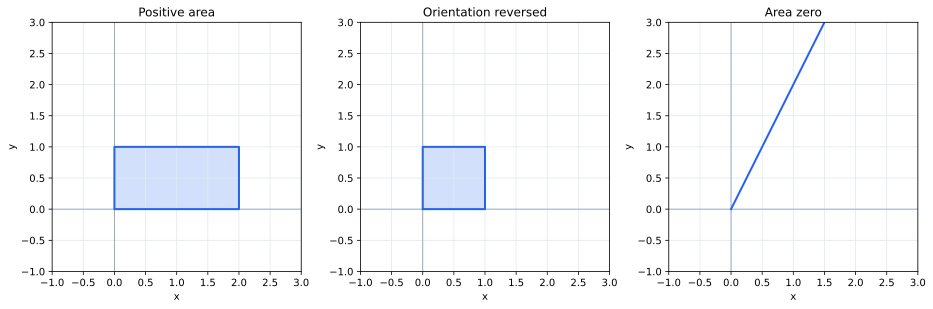

# 第7章 行列式――空間をどれだけ押し広げるか

第6章では、正方行列が可逆かどうかを、一次独立、階数、零空間などから判定した。

しかし「可逆か否か」だけでは、変換の様子を十分には表せない。たとえば二つの可逆変換があっても、一方は空間をほとんど押しつぶしかけており、もう一方は大きく広げているかもしれない。

そこで、正方行列による変換が**面積や体積を何倍にするか**を一つの数で測る。この量が行列式である。

## 一本の長さでは変換全体を測れない

$$
A=\begin{pmatrix}2&0\\0&3\end{pmatrix}
$$

は横方向を2倍、縦方向を3倍にする。単位正方形は縦3、横2の長方形へ移るので、面積は6倍になる。

一方

$$
S=\begin{pmatrix}1&2\\0&1\end{pmatrix}
$$

はせん断を表す。辺の長さは変わるが、単位正方形は面積1の平行四辺形へ移る。

したがって、各基底ベクトルの長さが何倍になったかだけでは変換全体の広がりは測れない。必要なのは、**独立な方向をまとめて見たときの面積・体積の倍率**である。

## 行列の列が作る平行四辺形を見る

2次正方行列

$$
A=(\mathbf a_1\ \mathbf a_2)
$$

を考える。単位正方形の二辺 $\mathbf e_1,\mathbf e_2$ は、それぞれ $\mathbf a_1,\mathbf a_2$ へ移る。

したがって、単位正方形は $\mathbf a_1,\mathbf a_2$ を辺とする平行四辺形へ移る。

この平行四辺形の面積が0なら、二本の列は同一直線上にある。つまり列は一次従属であり、変換は平面を直線以下へ押しつぶしている。

逆に面積が0でなければ、二本の列は一次独立で平面の基底になる。つまり変換は可逆である。

ここで、行列式と第II部の可逆性が直接つながる。

## 面積に向きを加える

通常の面積は常に0以上なので、鏡映のように向きを反転する変換を区別できない。

そこで、標準基底 $(\mathbf e_1,\mathbf e_2)$ と同じ向きなら正、逆向きなら負として符号を付ける。

> **定義（2次行列の行列式）**
>
> $2\times2$ 行列 $A$ の行列式 $\det A$ は、$A$ によって単位正方形が移ってできる平行四辺形の向き付き面積である。
>
> $|\det A|$ は面積倍率を表し、符号は向きが保たれたか反転したかを表す。

たとえば90度回転は面積も向きも保つので行列式は1、鏡映は面積を保ちながら向きを反転するので行列式は $-1$ である。

## 2次行列の公式

$$
A=\begin{pmatrix}a&b\\c&d\end{pmatrix}
$$

に対して、二列が張る平行四辺形の向き付き面積は

$$
\boxed{\det A=ad-bc}
$$

である。

たとえば

$$
A=\begin{pmatrix}3&1\\1&2\end{pmatrix}
$$

なら

$$
\det A=6-1=5.
$$

一方

$$
B=\begin{pmatrix}1&2\\2&4\end{pmatrix}
$$

では

$$
\det B=4-4=0.
$$

第二列が第一列の2倍なので、単位正方形は一本の直線へつぶれる。

ここで

$$
\det A=0
$$

が「面積が消える」「列が一次従属」「階数が2未満」「変換が可逆でない」という、第II部で見た現象と同じであることが分かる。

## 3次元では体積を測る

3次正方行列

$$
A=(\mathbf a_1\ \mathbf a_2\ \mathbf a_3)
$$

は、単位立方体の三本の辺を三列へ写す。したがって単位立方体は、三列を辺とする平行六面体へ移る。

3次行列の行列式は、この平行六面体の向き付き体積である。

対角行列

$$
D=\begin{pmatrix}
2&0&0\\
0&3&0\\
0&0&4
\end{pmatrix}
$$

では三方向をそれぞれ2倍、3倍、4倍するので

$$
\det D=24.
$$

三本の列が同じ平面内にあれば、高さが0になり体積も0になる。つまり3次元でも、行列式が0になることは列の一次従属と同じ現象である。

## 行列式が満たすべき性質

面積・体積として考えると、行列式には自然な性質がある。

一つの列を $c$ 倍すれば、その方向の尺度が $c$ 倍になるので、行列式も $c$ 倍になる。また一つの列が二本のベクトルの和なら、向き付き体積も対応して和になる。

つまり、ほかの列を固定すれば行列式は各列について線形である。

また二列が同じなら、独立な方向が一つ失われて体積が0になる。

さらに単位行列は単位立方体をそのまま保つので

$$
\det I=1.
$$

> **定理（行列式を特徴づける性質）**
>
> 正方行列の列から一つの数を作る規則で、
>
> 1. 各列について線形である。
> 2. 二列が同じなら0である。
> 3. $I$ に対して1である。
>
> を満たすものはただ一つであり、それが行列式である。

この見方では、行列式は複雑な公式として突然定義されるのではない。「向き付き体積の倍率を測りたい」という要求から、その性質がほぼ決まってしまう。

## $n$ 次元への一般化

$n\times n$ 行列

$$
A=(\mathbf a_1\ \cdots\ \mathbf a_n)
$$

は、標準基底の $n$ 本の方向を $\mathbf a_1,\ldots,\mathbf a_n$ へ送る。

4次元以上では図形を直接思い描きにくいが、構造は変わらない。$n$ 次元の単位超立方体がどれだけの向き付き $n$ 次元体積へ移るかを測る量が $\det A$ である。

> **定義（$n$ 次行列の行列式）**
>
> $n\times n$ 行列 $A$ の行列式 $\det A$ は、列について多重線形かつ交代的で、$\det I_n=1$ を満たす唯一の量である。幾何学的には、$A$ による向き付き $n$ 次元体積の倍率を表す。

正方行列に対して行列式を考える理由もここにある。同じ次元の空間から同じ次元の空間へ移すときにはじめて、「$n$ 次元体積が何倍になったか」を一つの倍率として比較できる。

## 可逆性を一つの数で見る

行列式の最大の利点の一つは、可逆性を一つの数で判定できることである。

変換が可逆なら、$n$ 個の独立な方向は失われず、$n$ 次元体積も0にはならない。

反対に

$$
\det A=0
$$

なら、単位超立方体は一つ以上低い次元へ押しつぶされている。そのため列は一次従属であり、変換は可逆でない。

したがって

$$
\boxed{A\text{ が可逆}\iff\det A\ne0}.
$$

これは次章で改めて計算法とともに確認する。

## この章のまとめ

行列式は、正方行列による線形変換が向き付き面積・体積を何倍にするかを表す。

絶対値は空間の広がりの倍率、符号は向きの反転を記録する。そして行列式が0になることは、体積が消えること、列が一次従属になること、階数が落ちること、逆変換が存在しないことと同じ現象である。

次章では、この幾何学的な量を実際にどう計算するかを考える。行基本変形、三角行列、余因子展開などは、すべて「体積倍率への影響が分かる操作」として導かれる。