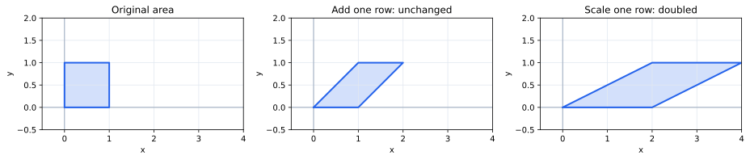
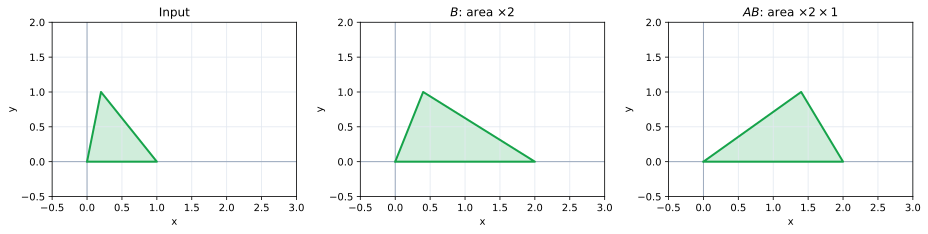

# 第8章 行列式を計算し、変換を見抜く

第7章では、行列式を向き付き体積の倍率として導入した。では、大きな行列についてその体積倍率をどう計算すればよいだろうか。

図形を直接描いて測ることはできない。そこで、行列を計算しやすい形へ変えながら、その操作が体積倍率に与える影響だけを追跡する。

この章では、行基本変形、三角行列、余因子展開、積の行列式を、すべて「体積倍率を追跡する方法」として整理する。

## 行基本変形は体積をどう変えるか

第4章では、行基本変形を解集合を保つ操作として使った。行列式を計算するときは、同じ操作を別の観点から見る。

> **定理（行基本変形と行列式）**
>
> 行列 $A$ に一回の行基本変形を施して $B$ を得るとき、
>
> 1. 二行を交換すると $\det B=-\det A$。
> 2. 一行を $c$ 倍すると $\det B=c\det A$。
> 3. 一行に別の行の $c$ 倍を加えても $\det B=\det A$。

第三の操作が行列式を変えないのは、せん断が体積を変えないことに対応している。

したがって、行列式を求めるときは行列を三角行列へ変形し、交換と定数倍だけを記録すればよい。

## 三角行列なら対角成分を見るだけでよい

上三角行列

$$
U=
\begin{pmatrix}
u_{11}&*&\cdots&*\\
0&u_{22}&\cdots&*\\
\vdots&\ddots&\ddots&\vdots\\
0&\cdots&0&u_{nn}
\end{pmatrix}
$$

では

$$
\boxed{\det U=u_{11}u_{22}\cdots u_{nn}}
$$

となる。

各対角成分は、その段階で新しく残る独立な方向の倍率と見なせる。どれか一つが0なら独立な方向が一つ失われ、体積も0になる。

したがって一般の行列では、行基本変形で三角形へ持っていくのが標準的な計算法になる。

たとえば

$$
A=\begin{pmatrix}
1&2&1\\
2&5&3\\
1&0&2
\end{pmatrix}
$$

に、行列式を変えない行の加法だけを使うと

$$
A\longrightarrow
\begin{pmatrix}
1&2&1\\
0&1&1\\
0&0&3
\end{pmatrix}.
$$

よって

$$
\det A=1\cdot1\cdot3=3.
$$

## 行列式が0になる瞬間を見る

掃き出しの途中でピボットが取れず、対角成分に0が現れたとする。

それは単なる計算上の失敗ではない。独立な方向が一つ足りず、階数が $n$ 未満であることを意味する。

したがって正方行列について

$$
\det A=0
\iff
\operatorname{rank}A<n
\iff
A\text{ の列は一次従属}
\iff
A\text{ は非可逆}
$$

である。

第II部で複数の条件として学んだ可逆性が、行列式では一つの数へ圧縮される。

## 余因子展開は小さな体積へ分解する

行列式には、ある行または列を基準にして、より小さな行列式へ分解する方法もある。

$n\times n$ 行列 $A=(a_{ij})$ から第 $i$ 行と第 $j$ 列を除いた行列の行列式を $M_{ij}$ とし

$$
C_{ij}=(-1)^{i+j}M_{ij}
$$

を余因子という。

> **定理（余因子展開）**
>
> 任意の行 $i$ に対して
>
> $$
> \det A=a_{i1}C_{i1}+\cdots+a_{in}C_{in}
> $$
>
> が成り立つ。任意の列についても同様である。

3次行列なら

$$
\det\begin{pmatrix}
a&b&c\\
d&e&f\\
g&h&i
\end{pmatrix}
=a\begin{vmatrix}e&f\\h&i\end{vmatrix}
-b\begin{vmatrix}d&f\\g&i\end{vmatrix}
+c\begin{vmatrix}d&e\\g&h\end{vmatrix}.
$$

余因子展開は、0が多い小さな行列では便利である。一方、大きな行列に機械的に使うと計算量が急増するので、数値計算では行基本変形の方が通常は適している。

## 合成すると体積倍率は掛け合わされる

行列積 $AB$ は、先に $B$、次に $A$ を作用させる合成変換だった。

$B$ が体積を $|\det B|$ 倍し、その結果を $A$ がさらに $|\det A|$ 倍するなら、全体では積だけ倍率が変わる。向きの反転も符号の積で追跡できる。

> **定理（積の行列式）**
>
> $$
> \boxed{\det(AB)=\det A\det B}
> $$

この式から、可逆行列について

$$
A^{-1}A=I
$$

なので

$$
\det(A^{-1})\det A=1,
$$

したがって

$$
\boxed{\det(A^{-1})=\frac1{\det A}}.
$$

逆変換は、元の変換が広げた分だけ縮め、縮めた分だけ広げる。

## 可逆性を行列式で判定する

第6章の可逆行列定理に、新しい条件を加えられる。

> **定理（可逆性と行列式）**
>
> $n\times n$ 行列 $A$ に対して
>
> $$
> \boxed{A\text{ が可逆}\iff\det A\ne0}
> $$

たとえば

$$
A_t=\begin{pmatrix}1&t\\2&4\end{pmatrix}
$$

なら

$$
\det A_t=4-2t.
$$

したがって $t=2$ のときだけ非可逆である。その瞬間、二列が同じ方向へ重なり、平面が直線へつぶれる。

行列式は、パラメータを含む変換がどこで性質を変えるかを見つけるのにも使える。

## 2次の逆行列公式はなぜ行列式で割るのか

$$
A=\begin{pmatrix}a&b\\c&d\end{pmatrix}
$$

について $ad-bc\ne0$ なら

$$
A^{-1}
=\frac1{ad-bc}
\begin{pmatrix}d&-b\\-c&a\end{pmatrix}.
$$

分母に $\det A$ が現れるのは偶然ではない。$\det A=0$ のときは変換が次元を押しつぶしており、逆変換を作れないからである。

一般の $n\times n$ 行列でも、余因子から随伴行列 $\operatorname{adj}A$ を作れば

$$
A^{-1}=\frac1{\det A}\operatorname{adj}A
$$

と書ける。

ただし大きな行列の逆行列を実際に求めるには、掃き出し法などを使う方が普通は効率的である。この公式は、逆行列が行列式と深く結び付いていることを示す理論的な式として重要である。

## この章のまとめ

行列式の計算は、意味のない記号操作ではない。行基本変形によって、向き付き体積がどう変化するかを追跡している。

三角行列では独立な方向の倍率が対角成分に現れ、その積が行列式になる。行列式が0ならどこかで独立な方向が失われ、階数が落ち、変換は非可逆になる。

また、変換を合成すると体積倍率も掛け合わされるため

$$
\det(AB)=\det A\det B
$$

が成り立つ。

第I〜III部を通して、一次独立、階数、可逆性、行列式はすべて「変換が空間の独立な方向を保っているか」という一つの問題へ収束した。

第IV部では別の問題に進む。同じベクトルや同じ線形変換でも、基底の選び方を変えると数による表示は変わる。その違いをどう整理するかを考える。