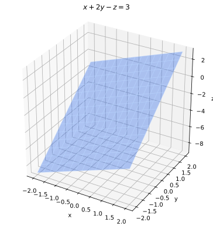
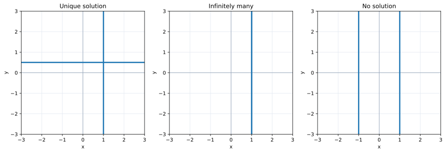
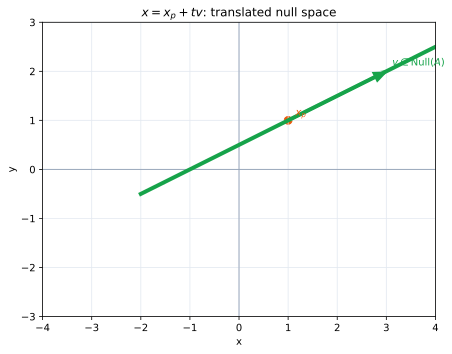

# 第4章 連立一次方程式――$A\mathbf x=\mathbf b$ の解を探す

第I部では、行列 $A$ とベクトル $\mathbf x$ から積 $A\mathbf x$ を求めた。第II部では逆に、行列 $A$ とベクトル $\mathbf b$ が与えられたとき、

$$
A\mathbf x=\mathbf b
$$

を満たすベクトル $\mathbf x$ を探す。この問題が連立一次方程式である。

この章の中心となる問いは三つある。方程式は解を持つか。持つなら解は一つだけか、それともいくつもあるか。そして、その解をどう計算するか。行基本変形とガウスの消去法は、これらに答えるための方法として導入する。

## $A\mathbf x=\mathbf b$ を逆向きに読む

まず

$$
A=\begin{pmatrix}1&2\\2&-1\end{pmatrix},\qquad
\mathbf b=\begin{pmatrix}5\\0\end{pmatrix}
$$

を考えよう。未知の入力を $\mathbf x=(x,y)^T$ とすると、$A\mathbf x=\mathbf b$ は

$$
\begin{pmatrix}1&2\\2&-1\end{pmatrix}
\begin{pmatrix}x\\y\end{pmatrix}
=\begin{pmatrix}5\\0\end{pmatrix}
$$

であり、成分ごとに書けば

$$
\begin{cases}
x+2y=5,\\
2x-y=0
\end{cases}
$$

となる。したがって、連立一次方程式は行列とは別の話ではない。固定された変換 $A$ に対して、指定された出力 $\mathbf b$ の**逆像**を探している。

列の一次結合として読めば、同じ問題は

$$
x\begin{pmatrix}1\\2\end{pmatrix}
+y\begin{pmatrix}2\\-1\end{pmatrix}
=\begin{pmatrix}5\\0\end{pmatrix}
$$

となる。入力の成分 $x,y$ は、二本の列をどれだけ使えば目標の出力 $\mathbf b$ を作れるかを指定する係数である。この例では $x=1,y=2$ が答えになる。

一般に、$m\times n$ 行列 $A$ と $\mathbf b\in\mathbb R^m$ に対する $A\mathbf x=\mathbf b$ は、$n$ 個の未知数を持つ $m$ 本の一次方程式である。同時に、$A$ の列の一次結合で $\mathbf b$ を作る問題でもあり、線形変換 $A:\mathbb R^n\to\mathbb R^m$ の出力から入力を探す問題でもある。この三つは同じ問題の異なる読み方である。

## 一つの方程式を平面として見る

連立方程式の各式を、未知数への条件として見てみよう。

$$
x+2y=5
$$

を満たす $(x,y)$ は平面上の一本の直線を作る。一方、$2x-y=0$ も別の直線を作る。二つの式を同時に満たす入力は、二直線の交点である。この例では交点が一つなので解も一つになる。

未知数が三つなら、一つの一次方程式

$$
x+2y-z=3
$$

は $\mathbb R^3$ 内の平面を表す。複数の式を同時に満たす解は、これらの平面すべてに共通する点、直線、あるいは平面として現れる。共通部分が空なら解はない。

この見方から、連立一次方程式の解の個数がなぜ「一つ」「無数」「存在しない」の三種類になるのかが見える。一次方程式で切り出される図形は連続しているので、異なる二つの解があれば、その二点を結ぶ直線上にも解が並ぶ。したがって、解が有限個だけ複数存在することはない。

ただし未知数が増えると、平面を頭の中で交差させるだけでは計算できない。そこで、解集合を変えずに方程式を読みやすい形へ変える。

## 解を変えない行基本変形

係数を固定して入力 $(x,y,z)$ を動かすと、一つの一次方程式を満たす点が平面を埋める。連立方程式では、このような平面どうしの共通部分を探す。

先ほどの式

$$
\begin{cases}
x+2y=5,\\
2x-y=0
\end{cases}
$$

で、第二式から第一式の2倍を引くと

$$
-5y=-10
$$

が得られる。この新しい式は、元の二式を満たす入力なら必ず満たす。逆に、第一式と新しい式を満たせば、そこから元の第二式も復元できる。したがって解集合は変わらない。

連立方程式の係数と右辺をまとめた

$$
\left(\begin{array}{cc|c}
1&2&5\\
2&-1&0
\end{array}\right)
$$

を**拡大係数行列**という。縦線の左は入力を出力へ送る規則 $A$、右は目標出力 $\mathbf b$ である。方程式に許される次の三操作を、拡大係数行列の行に施すことを**行基本変形**という。

1. 二つの行を入れ替える。
2. 一つの行を0でない数倍する。
3. 一つの行に別の行の定数倍を加える。

これらはそれぞれ、条件を並べ替える、同じ条件を別の倍率で書く、既存の条件から同値な条件を作る操作である。どれも逆の操作ができるため、変形前後で解となる入力は変わらない。

例を続けると

$$
\left(\begin{array}{cc|c}
1&2&5\\
2&-1&0
\end{array}\right)
\longrightarrow
\left(\begin{array}{cc|c}
1&2&5\\
0&-5&-10
\end{array}\right)
\longrightarrow
\left(\begin{array}{cc|c}
1&2&5\\
0&1&2
\end{array}\right).
$$

ここから $y=2$、第一式へ戻して $x=1$ と分かる。行基本変形は行列の見た目を変えるが、探している入力の集合は保っている。

## 階段形から未知数を求める

三つの未知数を持つ例を考えよう。

$$
\begin{cases}
x+y+z=6,\\
2x+y-z=1,\\
x-y+2z=5
\end{cases}
$$

拡大係数行列を行基本変形すると、たとえば

$$
\left(\begin{array}{ccc|c}
1&1&1&6\\
2&1&-1&1\\
1&-1&2&5
\end{array}\right)
\longrightarrow
\left(\begin{array}{ccc|c}
1&1&1&6\\
0&-1&-3&-11\\
0&0&7&21
\end{array}\right)
$$

とできる。このように、各行で最初に現れる0でない成分が、下の行ほど右へ移る形を**階段形**という。各行の先頭の0でない成分を**主成分**または**ピボット**と呼ぶ。

一番下から $7z=21$ より $z=3$、次に $-y-3z=-11$ より $y=2$、最後に $x+y+z=6$ より $x=1$ と復元できる。これを**後退代入**という。階段形は、複数の未知数が混ざった条件を、一番下から一つずつ入力成分を決められる順序へ整理したものなのである。

さらに各ピボットを1にし、その上下を0にすると

$$
\left(\begin{array}{ccc|c}
1&0&0&1\\
0&1&0&2\\
0&0&1&3
\end{array}\right)
$$

のような**簡約階段形**になる。ここまで変形すれば、入力がそのまま読み取れる。階段形は一意とは限らないが、簡約階段形は元の行列ごとに一意に決まる。

## 解が一つ、無数、存在しない場合

階段形では、解の三つの場合を見分けられる。

まず

$$
\left(\begin{array}{cc|c}
1&0&2\\
0&1&-1
\end{array}\right)
$$

のように、すべての未知数の列にピボットがあれば、各入力成分が決まり、解は一つである。

次に

$$
\left(\begin{array}{ccc|c}
1&2&-1&3\\
0&0&1&2
\end{array}\right)
$$

では $y$ の列にピボットがない。$y=t$ と自由に選べば、$z=2$、$x=5-2t$ となるので

$$
\begin{pmatrix}x\\y\\z\end{pmatrix}
=\begin{pmatrix}5\\0\\2\end{pmatrix}
+t\begin{pmatrix}-2\\1\\0\end{pmatrix}
$$

と書ける。ピボットのない列に対応する未知数を**自由変数**という。自由変数を動かすたびに別の入力が同じ出力を作るため、解は無数にある。

最後に

$$
\left(\begin{array}{cc|c}
1&2&3\\
0&0&1
\end{array}\right)
$$

には $0=1$ という不可能な条件が含まれる。この場合は指定された出力へ届く入力がなく、解は存在しない。拡大係数行列の右端だけにピボットが現れることが、矛盾の印である。

したがって、未知数列のピボットは入力がどれだけ決まるかを示し、右辺列のピボットは目標出力が到達不能であることを示す。

## 同次方程式と一般解

2次元では各方程式が直線を表す。異なる向きなら交点が一つ、同じ直線なら共通点が無数、平行で異なる直線なら共通点がない。

特殊解は解集合上の基準点を一つ選んだものにすぎない。そこから零空間の方向へどれだけ動いても、出力は変化しない。

右辺が零ベクトルである

$$
A\mathbf x=\mathbf0
$$

を**同次方程式**という。$A\mathbf0=\mathbf0$ なので、同次方程式は少なくとも自明な解 $\mathbf x=\mathbf0$ を持つ。問題は、零でない解も存在するかどうかである。

たとえば

$$
A=\begin{pmatrix}1&2&-1\\2&4&-2\end{pmatrix}
$$

なら、方程式は実質 $x+2y-z=0$ の一つだけである。$y=s,z=t$ と置けば

$$
\mathbf x
=s\begin{pmatrix}-2\\1\\0\end{pmatrix}
+t\begin{pmatrix}1\\0\\1\end{pmatrix}.
$$

これらは $A\mathbf x=\mathbf0$ を満たすベクトルであり、第3章で導入した核そのものである。

では $A\mathbf x=\mathbf b$ に一つの解 $\mathbf x_p$ が見つかったとしよう。$A\mathbf x_h=\mathbf0$ を満たす任意の $\mathbf x_h$ に対して

$$
A(\mathbf x_p+\mathbf x_h)=A\mathbf x_p+A\mathbf x_h=\mathbf b
$$

だから、$\mathbf x_p+\mathbf x_h$ も解である。逆に二つの解の差は必ず同次方程式の解になる。したがって一般解は

$$
\boxed{\text{一般解}=\text{一つの特殊解}+\text{同次方程式の一般解}}
$$

と書ける。指定された出力 $\mathbf b$ は解集合の位置を決め、行列 $A$ の核は解集合が伸びる方向を決めている。

## ガウスの消去法

ここまでの操作を計算法として整理したものが**ガウスの消去法**である。

1. 左から順にピボットとなる成分を選ぶ。必要なら行を入れ替える。
2. ピボットより下の成分を、行の定数倍を加えて0にする。
3. 右下の部分へ移り、同じ操作を繰り返して階段形を作る。
4. 後退代入するか、さらにピボットの上も0にして簡約階段形を作る。

たとえば

$$
\left(\begin{array}{ccc|c}
1&1&-1&1\\
2&3&1&8\\
-1&1&2&1
\end{array}\right)
$$

に対し、第一列の下を消し、次に第二列の下を消すと

$$
\left(\begin{array}{ccc|c}
1&1&-1&1\\
0&1&3&6\\
0&0&-3&-6
\end{array}\right)
$$

となる。ここから $z=2,y=0,x=3$ を得る。

手順だけを暗記するより、各操作が「同じ解集合を別の条件で記述し直す」ものだと理解することが重要である。計算途中の行列は別の線形変換を表すが、拡大係数行列全体としては、指定された出力を生む入力の集合を変えていない。

## この章のまとめ

連立一次方程式 $A\mathbf x=\mathbf b$ は、固定された線形変換 $A$ と指定された出力 $\mathbf b$ から、元の入力 $\mathbf x$ を探す問題である。列の一次結合としては、$A$ の列から $\mathbf b$ を作る係数を探している。

行基本変形は解集合を保ったまま条件を整理し、階段形のピボットはどの未知数が決まり、どれが自由に残るかを示す。右辺列にだけピボットがあれば方程式は矛盾し、解を持たない。同次方程式の解は $A\mathbf x=\mathbf0$ を満たす方向であり、一般の解集合は一つの特殊解をその方向へずらして得られる。

次章では、個々の右辺について解くことから一歩引き、行列 $A$ が到達できる出力全体と、零へ押しつぶす入力全体を調べる。それらを部分空間と階数の言葉で測ると、解の存在と一意性を行列全体の性質として説明できる。
