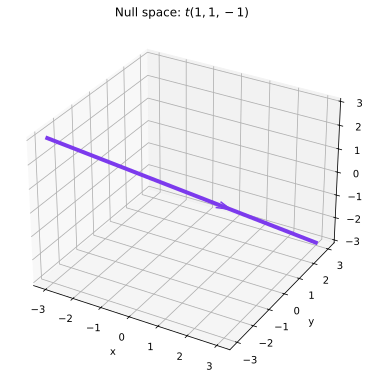
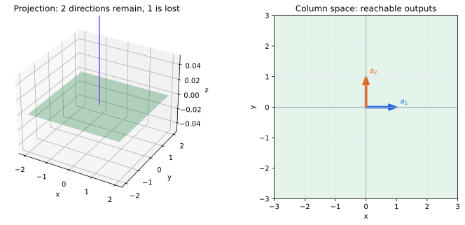

# 第5章 部分空間と階数――どこまで届き、何が失われるか

第4章では、右辺 $\mathbf b$ を一つ選んで $A\mathbf x=\mathbf b$ を解いた。しかし、固定した行列 $A$ について本当に知りたいのは、個々の $\mathbf b$ ではない。

**どの $\mathbf b$ なら到達できるのか。**

**異なる $\mathbf x$ が同じ像へ重なる方向はどれだけあるのか。**

この二つをまとめて表すのが列空間と零空間である。そして、それらの次元を数えることで、変換が何次元分の情報を残し、何次元分を失うかを測れるようになる。

## 線形変換から自然に部分空間が現れる

平面を $x$ 軸へ射影する

$$
T\begin{pmatrix}x\\y\end{pmatrix}
=\begin{pmatrix}x\\0\end{pmatrix}
$$

を考える。到達できるベクトルは $x$ 軸上にあり、零ベクトルへ押しつぶされるベクトルは $y$ 軸上にある。

どちらも、零ベクトルを含み、そこにあるベクトルを足してもスカラー倍しても外へ出ない。

> **定義（部分空間）**
>
> $\mathbb R^n$ の部分集合 $W$ が、零ベクトルを含み、加法とスカラー倍について閉じているとき、$W$ を $\mathbb R^n$ の部分空間という。

線形変換に伴う「到達できる範囲」と「零へ消える方向」は、どちらも部分空間になる。

## 列空間――どこまで到達できるか

行列

$$
A=(\mathbf a_1\ \cdots\ \mathbf a_n)
$$

に対して

$$
A\mathbf x=x_1\mathbf a_1+\cdots+x_n\mathbf a_n.
$$

したがって、$\mathbf x$ を自由に動かして得られる像全体は、列ベクトルの一次結合全体である。

> **定義（列空間）**
>
> $$
> \operatorname{Col}(A)
> =\{A\mathbf x\mid\mathbf x\in\mathbb R^n\}
> =\operatorname{span}\{\mathbf a_1,\ldots,\mathbf a_n\}
> $$
>
> を $A$ の列空間という。

これは第3章で導入した像 $\operatorname{Im}A$ と同じ対象である。

したがって

$$
\boxed{A\mathbf x=\mathbf b\text{ が解をもつ}
\iff
\mathbf b\in\operatorname{Col}(A)}.
$$

つまり列空間とは、固定した変換 $A$ が到達できる範囲そのものである。

## 零空間――何を変えても像が変わらないか

次に

$$
A\mathbf x=\mathbf0
$$

を満たす $\mathbf x$ 全体を集める。

> **定義（零空間）**
>
> $$
> \operatorname{Null}(A)
> =\{\mathbf x\in\mathbb R^n\mid A\mathbf x=\mathbf0\}
> $$
>
> を $A$ の零空間という。

これは第3章の核 $\ker A$ と同じ対象である。

零でない $\mathbf h\in\operatorname{Null}(A)$ があれば

$$
A(\mathbf x+\mathbf h)=A\mathbf x
$$

だから、$\mathbf h$ 方向の違いは変換後には見えない。

逆に、$A\mathbf x=A\mathbf y$ なら

$$
A(\mathbf x-\mathbf y)=\mathbf0
$$

なので、二つの入力の違い $\mathbf x-\mathbf y$ は零空間に入る。

したがって

$$
\boxed{A\mathbf x=\mathbf b\text{ の解が高々一つ}
\iff
\operatorname{Null}(A)=\{\mathbf0\}}.
$$

零空間は、変換によって失われる違いを集めた空間である。

## 階数――到達できる独立な方向はいくつあるか

列空間そのものが分かれば到達範囲は分かる。しかし、変換がどれほど豊かな範囲へ届くかを一つの数で測りたい。

そこで列空間の次元を数える。

> **定義（階数）**
>
> $$
> \operatorname{rank}A=\dim\operatorname{Col}(A)
> $$
>
> を $A$ の階数という。

階数は、変換後に残っている独立な方向の本数である。

平面を直線へ射影すれば階数は1、平面全体を保つなら2、すべてを零ベクトルへ送るなら0である。

階段形にしたときのピボットの個数が階数になる。各ピボットは、ほかでは作れない独立な列方向が一つ残っていることを示している。

## 退化次数――失われる独立な方向はいくつあるか

零空間についても、その次元を数える。

> **定義（退化次数）**
>
> $$
> \operatorname{nullity}A=\dim\operatorname{Null}(A)
> $$
>
> を $A$ の退化次数という。

これは、変換後には区別できなくなる独立な方向の本数である。

たとえば $\mathbb R^3$ を平面へ射影する変換なら、二方向は残り、一方向が失われるので

$$
\operatorname{rank}A=2,\qquad
\operatorname{nullity}A=1.
$$

ここで重要な関係が現れる。

> **定理（階数・退化次数の定理）**
>
> $A$ が $n$ 成分のベクトルを受け取るとき
>
> $$
> \boxed{\operatorname{rank}A+\operatorname{nullity}A=n}
> $$
>
> が成り立つ。

入力側にあった $n$ 個の独立な方向は、変換後に残る方向と、零へ失われる方向に分かれるのである。

階段形で見れば、$n$ 個の変数のうちピボット変数の個数が階数、自由変数の個数が退化次数であり、その合計は必ず $n$ になる。

## 一次独立がここで再び効いてくる

第2章で一次独立を導入したとき、「余分なベクトルがない」という意味で理解した。

いま行列の列について考えると、列が一次独立であることは

$$
A\mathbf x=\mathbf0
$$

が $\mathbf x=\mathbf0$ しか解をもたないことと同じである。つまり

$$
\operatorname{Null}(A)=\{\mathbf0\}
$$

である。

そのとき

$$
\operatorname{nullity}A=0,\qquad
\operatorname{rank}A=n.
$$

したがって一次独立とは、単に列の関係を分類する言葉ではなく、**変換が入力側の方向を一つも失わないこと**を表している。

## 行空間は条件の独立性を表す

$m\times n$ 行列 $A$ の各行は、$\mathbb R^n$ のベクトルとして読める。その行ベクトルが張る空間を行空間という。

> **定義（行空間）**
>
> $A$ の行ベクトルが張る部分空間を $\operatorname{Row}(A)$ と書く。

各行は、入力 $\mathbf x$ に対して一つの線形な条件を読み取っている。行が一次従属なら、その条件の一つはほかの条件から作れるので、新しい情報を加えていない。

行基本変形は行空間を変えない。そのため階段形の0でない行は、元の行空間の基底になる。

そして

$$
\dim\operatorname{Row}(A)
=\dim\operatorname{Col}(A)
=\operatorname{rank}A
$$

が成り立つ。行から見ても列から見ても、独立な情報の本数は同じなのである。

## $A\mathbf x=\mathbf b$ の一般解を空間として見る

$A\mathbf x=\mathbf b$ に一つの解 $\mathbf x_p$ が存在するとする。第4章で見たように、すべての解は

$$
\mathbf x=\mathbf x_p+\mathbf h,\qquad
\mathbf h\in\operatorname{Null}(A)
$$

と書ける。

したがって、解集合の自由度は零空間の次元、すなわち退化次数で決まる。

零空間が0次元なら解は一つ。1次元なら一本の直線状に解が並び、2次元なら平面状に広がる。

これによって「自由変数が何個あるか」という計算上の話と、「解集合が何次元か」という幾何学的な話が同じになる。

## この章のまとめ

固定した行列 $A$ に対して、列空間は到達できる範囲、零空間は変換によって失われる違いを表す。

階数は到達できる独立な方向の数、退化次数は失われる独立な方向の数であり、

$$
\operatorname{rank}A+\operatorname{nullity}A=n
$$

によって入力側の次元を分け合う。

ここまでで、$A\mathbf x=\mathbf b$ の解が存在するか、一意か、何次元の自由度をもつかを、変換全体の構造として説明できるようになった。

次章では特に正方行列に注目し、「すべての $\mathbf b$ にちょうど一つの $\mathbf x$ が対応する」という最も理想的な場合を調べる。