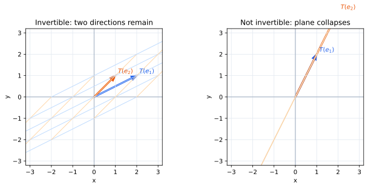
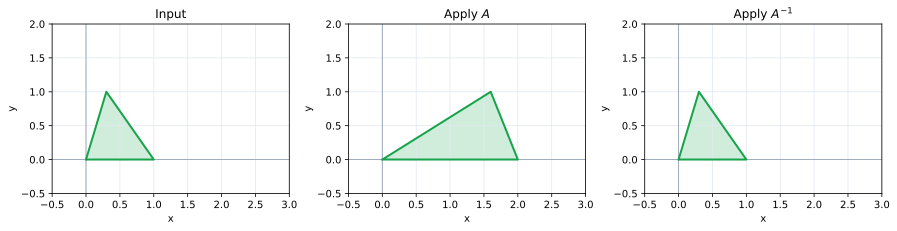

# 第6章 可逆性――すべてのベクトルに一対一で対応できるとき

第4章では $A\mathbf x=\mathbf b$ の解を求め、第5章では解の存在と一意性を別々に調べた。

ここで正方行列 $A:\mathbb R^n\to\mathbb R^n$ について、最も理想的な場合を考えよう。

**どの $\mathbf b$ にも到達でき、しかもその到達方法がただ一つである。**

このとき、変換後のベクトルから変換前のベクトルを完全に復元できる。この性質が可逆性である。

## 「元に戻せる」とは何を意味するか

$$
A=\begin{pmatrix}2&0\\0&3\end{pmatrix}
$$

は

$$
\begin{pmatrix}x\\y\end{pmatrix}
\longmapsto
\begin{pmatrix}2x\\3y\end{pmatrix}
$$

という変換を表す。

変換後のベクトル $(u,v)^T$ が分かれば

$$
x=\frac u2,\qquad y=\frac v3
$$

と元へ戻せる。その逆向きの変換は

$$
A^{-1}=\begin{pmatrix}1/2&0\\0&1/3\end{pmatrix}
$$

であり

$$
A^{-1}A=AA^{-1}=I
$$

を満たす。

> **定義（可逆行列・逆行列）**
>
> 正方行列 $A$ に対し
>
> $$
> AB=BA=I
> $$
>
> を満たす行列 $B$ が存在するとき、$A$ は可逆であるという。この $B$ を $A^{-1}$ と書き、$A$ の逆行列という。

逆行列は、行列を形式的に打ち消すための記号ではない。線形変換を逆向きにたどる別の線形変換である。

## 元に戻せない二つの理由

変換を元に戻せない理由は、第5章で見た二つに分かれる。

一つは、異なる入力が同じ像へ重なってしまうことだ。たとえば

$$
C=\begin{pmatrix}1&1\\2&2\end{pmatrix}
$$

では

$$
C\begin{pmatrix}1\\0\end{pmatrix}
=C\begin{pmatrix}0\\1\end{pmatrix}
=\begin{pmatrix}1\\2\end{pmatrix}.
$$

出力だけを見ても、どちらの入力だったか判定できない。

もう一つは、そもそも到達できない出力があることだ。この $C$ の列空間は一本の直線なので、平面上の多くのベクトルには届かない。

正方行列では、この二つは実は同時に起こる。入力側と出力側の次元が同じだから、独立な方向を一つ失えば出力空間全体を埋められず、逆に出力空間を埋めるだけの独立な方向があれば入力の重複もない。

## 基底が基底へ移れば可逆である

正方行列

$$
A=(\mathbf a_1\ \cdots\ \mathbf a_n)
$$

の列は標準基底の行き先である。

もし $\mathbf a_1,\ldots,\mathbf a_n$ が $\mathbb R^n$ の基底なら、任意の $\mathbf b$ は

$$
\mathbf b=x_1\mathbf a_1+\cdots+x_n\mathbf a_n
$$

とただ一通りに表せる。つまり $A\mathbf x=\mathbf b$ は、どの $\mathbf b$ に対してもちょうど一つ解をもつ。

したがって、可逆な線形変換とは**ある基底を別の基底へ送る変換**である。

左では二本の独立な方向が独立なまま残り、右では二本が同じ方向へ重なっている。

## 可逆行列定理――これまでの概念が一つに合流する

ここまで導入してきた概念は、正方行列ではすべて同じ現象を記述している。

> **定理（可逆行列定理）**
>
> $n\times n$ 行列 $A$ について、次はすべて同値である。
>
> 1. $A$ は可逆である。
> 2. 任意の $\mathbf b\in\mathbb R^n$ に対して $A\mathbf x=\mathbf b$ はただ一つ解をもつ。
> 3. $A\mathbf x=\mathbf0$ の解は $\mathbf0$ だけである。
> 4. $A$ の列は一次独立である。
> 5. $A$ の列は $\mathbb R^n$ を張る。
> 6. $A$ の列は $\mathbb R^n$ の基底である。
> 7. $\operatorname{Null}(A)=\{\mathbf0\}$ である。
> 8. $\operatorname{Col}(A)=\mathbb R^n$ である。
> 9. $\operatorname{rank}A=n$ である。
> 10. $A$ の簡約階段形は $I$ である。

この一覧を別々の事実として暗記する必要はない。

「列が一次独立」なら零空間は0次元である。階数・退化次数の定理より階数は $n$ になる。出力側も $n$ 次元なので列空間は $\mathbb R^n$ 全体になる。したがって、どの $\mathbf b$ にもただ一つの $\mathbf x$ が対応する。

一つの筋道を理解すれば、残りは同じ現象の言い換えとして復元できる。

## 逆行列をどう求めるか

逆行列の第 $j$ 列を $\mathbf x_j$ とすると

$$
A\mathbf x_j=\mathbf e_j
$$

でなければならない。

つまり逆行列を求めるとは

$$
A\mathbf x=\mathbf e_1,\quad
A\mathbf x=\mathbf e_2,\quad\ldots,\quad
A\mathbf x=\mathbf e_n
$$

をまとめて解くことである。

そこで

$$
(A\mid I)
$$

を作り、左側を $I$ にするように行基本変形する。

$$
(A\mid I)\longrightarrow(I\mid A^{-1}).
$$

たとえば

$$
A=\begin{pmatrix}1&2\\3&4\end{pmatrix}
$$

なら

$$
\left(\begin{array}{cc|cc}
1&2&1&0\\
3&4&0&1
\end{array}\right)
\longrightarrow
\left(\begin{array}{cc|cc}
1&0&-2&1\\
0&1&3/2&-1/2
\end{array}\right),
$$

したがって

$$
A^{-1}=\begin{pmatrix}-2&1\\3/2&-1/2\end{pmatrix}.
$$

左側を $I$ にできなければ、ピボットが不足しているので $A$ は可逆でない。

## 逆行列で方程式を解く

$A$ が可逆なら

$$
A\mathbf x=\mathbf b
$$

に逆変換を作用させて

$$
\boxed{\mathbf x=A^{-1}\mathbf b}
$$

と書ける。

ただし、一つの右辺に対する数値解だけが欲しいなら、実際の計算では逆行列全体を先に求めるより、$A\mathbf x=\mathbf b$ を直接消去するほうが普通は効率的である。

逆行列の価値は、「どの $\mathbf b$ に対しても使える固定された逆変換」を一つの行列として持てることにある。

## 合成を元に戻す順序

二つの可逆行列 $A,B$ による変換を考える。$AB$ は先に $B$、次に $A$ を作用させる。

これを元に戻すには、最後に行った $A$ をまず戻し、その後 $B$ を戻す。したがって

$$
\boxed{(AB)^{-1}=B^{-1}A^{-1}}.
$$

これは記号操作ではなく、変換を逆順にたどることから必然的に出てくる。

## 長方形行列では何が起こるか

入力と出力の次元が違うと、両方向で完全に元へ戻すことはできない。

$m>n$ の $m\times n$ 行列では、列が一次独立なら入力の違いを失わない。しかし出力空間全体へは届かない。この場合、実際に到達した像から入力を復元する左逆行列をもてることがある。

反対に $m<n$ なら、出力空間全体へ届くことはできても、入力側には必ず失われる方向が残る。この場合には右逆行列をもてることがある。

正方行列ではじめて、「失わない」と「全部に届く」を同時に満たせる。

## この章のまとめ

可逆性は、第I部と第II部で導入した概念が一つに集約される場所である。

一次独立なら入力の違いを失わず、張るならすべての出力へ届く。正方行列ではこの二つが同値になり、列が基底であること、階数が最大であること、零空間が自明であること、すべての連立方程式が一意に解けること、逆行列が存在することがすべて同じ意味になる。

では、この可逆性をもっと素早く判定できないだろうか。また、可逆か否かだけでなく、変換が空間をどれほど押し広げたり押しつぶしたりしているかを、一つの数で測れないだろうか。

第III部では、その問いから行列式を導入する。