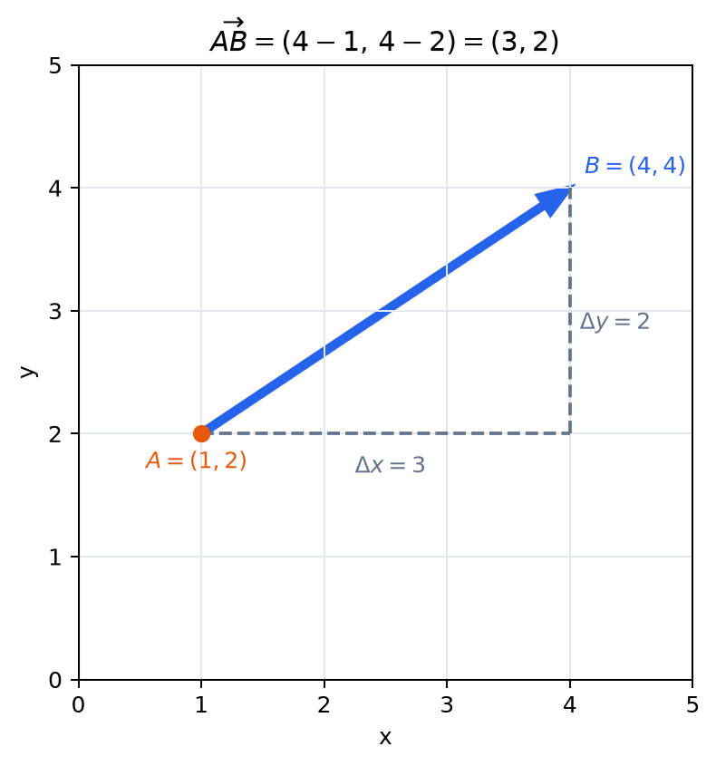
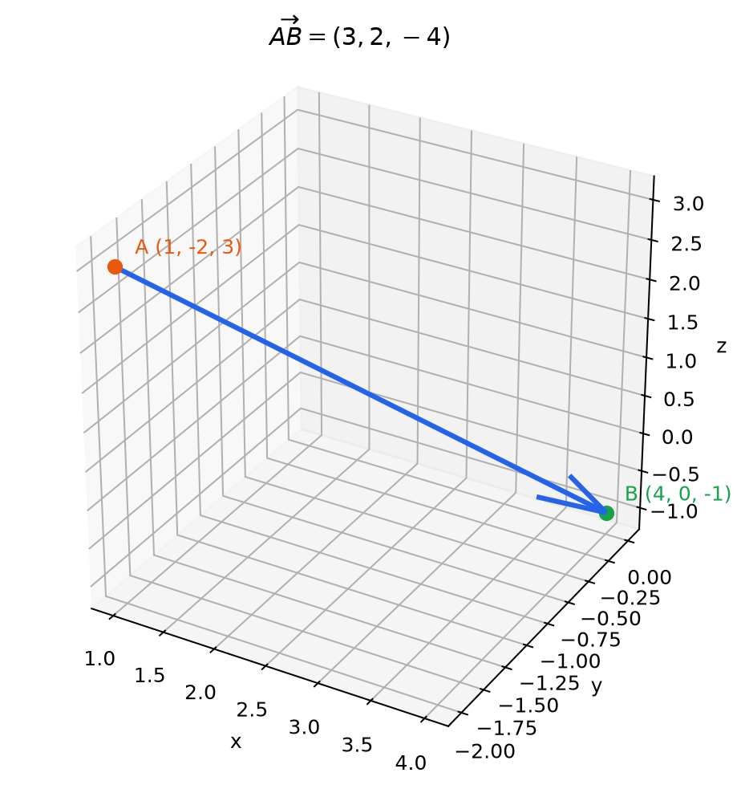

# 平面と空間のベクトル

- ベクトルを「向きと大きさをもつ量」として捉える
- ベクトルと、ベクトルを表す矢印とを区別する
- 平面ベクトルを2個の数、空間ベクトルを3個の数で表す
- 平面・空間で得た考え方を $N$ 次元ベクトルへ一般化する
- 点の座標とベクトルの成分の違いを説明する
- 同じベクトルは、場所を移しても同じ向きと大きさをもつことを理解する

## なぜベクトルを考えるのか

大きさだけでは表せない「どちらへ、どれだけ」という情報を、一つの対象として計算するためである。矢印を成分で表せるようにすると、移動や力のような幾何的な現象を数式で扱え、後に学ぶ線形変換の入力にもできる。

## 1. ベクトルとは何か

「東へ3 km進む」という指示には、**東へ**という向きと、**3 km**という大きさがある。このように、向きと大きさをあわせてもつ量を**ベクトル**という。

ベクトルは矢印で表せる。矢印の向きがベクトルの向きを、矢印の長さがベクトルの大きさを表す。

一方、気温が20 ℃である、面積が5 m²である、という量には向きがない。このように大きさだけで表される量を**スカラー**という。

ベクトルの例には、変位、速度、力などがある。ただし、線形代数で扱うベクトルは物理量に限らない。数の組や関数なども、後にベクトルとして扱えるようになる。まずは平面や空間の矢印から考えよう。

> **【重要】ベクトルとスカラーを区別する**  
> 向きをもつ量か、大きさだけの量かという区別は、式の意味や許される演算を判断する出発点になるため、用語とともに覚えておこう。

## 2. 始点と終点

点 $A$ から点 $B$ へ向かう矢印が表すベクトルを

$$
\overrightarrow{AB}
$$

と書く。$A$ を**始点**、$B$ を**終点**という。文字を一つだけ使い、$\boldsymbol{v}$ や $\boldsymbol{a}$ と書くことも多い。

ベクトルそのものにとって重要なのは、矢印がどこに描かれているかではなく、その向きと大きさである。したがって、平行移動してぴったり重なる二つの矢印は同じベクトルを表す。

たとえば、どちらも「右へ2、上へ1」進む矢印なら、始点が異なっていても同じベクトルである。この考え方を、ベクトルを自由に移動できるという意味で**自由ベクトル**の考え方という。

## 3. 平面ベクトルの成分表示

平面上で、右向きを $x$ 軸の正の向き、上向きを $y$ 軸の正の向きとする。右へ $a$、上へ $b$ 進むベクトルを

$$
\boldsymbol{v}=
\begin{pmatrix}
a\\
b
\end{pmatrix}
$$

と表す。$a,b$ をベクトル $\boldsymbol{v}$ の**成分**という。

- $a>0$ なら右へ、$a<0$ なら左へ進む
- $b>0$ なら上へ、$b<0$ なら下へ進む
- 成分が $0$ なら、その方向には進まない

たとえば

$$
\boldsymbol{v}=
\begin{pmatrix}
3\\
2
\end{pmatrix}
$$

は「右へ3、上へ2」進むベクトルである。

### 例1：2点から成分を求める

$A=(1,2)$、$B=(4,4)$ とする。$A$ から $B$ へ進むには、$x$ 方向に $4-1=3$、$y$ 方向に $4-2=2$ だけ進めばよい。したがって

*図：終点から始点を成分ごとに引くと、$A$ から $B$ への移動量が得られる。*

$$
\overrightarrow{AB}
=
\begin{pmatrix}
4-1\\
4-2
\end{pmatrix}
=
\begin{pmatrix}
3\\
2
\end{pmatrix}.
$$

一般に、$A=(x_1,y_1)$、$B=(x_2,y_2)$ なら

$$
\overrightarrow{AB}
=
\begin{pmatrix}
x_2-x_1\\
y_2-y_1
\end{pmatrix}.
$$

> **【重要】終点 − 始点**  
> ベクトルの成分は「終点の座標から始点の座標を引く」ことで求める。この計算は今後、ベクトルの問題で繰り返し使うため、向きを取り違えないように覚えておこう。

## 4. 点とベクトルは同じものか

点 $(3,2)$ とベクトル

$$
\begin{pmatrix}3\\2\end{pmatrix}
$$

は、同じ二つの数を使って表されるが、意味は異なる。

- 点 $(3,2)$ は、平面上の**場所**を表す
- ベクトル $\begin{pmatrix}3\\2\end{pmatrix}$ は、右へ3、上へ2という**移動**を表す

ただし、原点 $O=(0,0)$ から点 $P=(3,2)$ へ向かうベクトルは

$$
\overrightarrow{OP}
=
\begin{pmatrix}3\\2\end{pmatrix}
$$

となる。この $\overrightarrow{OP}$ を点 $P$ の**位置ベクトル**という。原点を固定すれば、点とその位置ベクトルを対応させられるため、両者を同一視することも多い。

## 5. 零ベクトル

始点と終点が同じ矢印は、どの方向にもまったく進まない。そのベクトルを**零ベクトル**といい、$\boldsymbol{0}$ と書く。

平面では

$$
\boldsymbol{0}=
\begin{pmatrix}0\\0\end{pmatrix}
$$

である。零ベクトルの大きさは $0$ であり、特定の向きをもたない。

## 6. 空間ベクトル

3次元空間では、左右と上下に加えて、奥行きの方向が必要になる。そこで、空間ベクトルを3個の成分で

$$
\boldsymbol{v}=
\begin{pmatrix}
a\\
b\\
c
\end{pmatrix}
$$

と表す。$a,b,c$ は、それぞれ $x,y,z$ 方向への移動量である。

たとえば

$$
\begin{pmatrix}
2\\
-1\\
3
\end{pmatrix}
$$

は、$x$ 方向へ2、$y$ 方向へ $-1$、$z$ 方向へ3進むベクトルを表す。

空間内の2点 $A=(x_1,y_1,z_1)$、$B=(x_2,y_2,z_2)$ に対しても、平面の場合と同じように

$$
\overrightarrow{AB}
=
\begin{pmatrix}
x_2-x_1\\
y_2-y_1\\
z_2-z_1
\end{pmatrix}
$$

となる。次元が一つ増えても、「各方向にどれだけ進むか」を並べるという考え方は変わらない。

### 例2：空間内の2点

$A=(1,-2,3)$、$B=(4,0,-1)$ とすると

*図：3次元でも、各座標軸の方向への移動を順に合成して $\overrightarrow{AB}$ を捉えられる。*

$$
\overrightarrow{AB}
=
\begin{pmatrix}
4-1\\
0-(-2)\\
-1-3
\end{pmatrix}
=
\begin{pmatrix}
3\\
2\\
-4
\end{pmatrix}.
$$

## 7. $N$ 次元ベクトルへの一般化

平面では2方向、空間では3方向への移動量を並べてベクトルを表した。同じ考え方で、$N$ 個の成分をもつベクトルを

$$
\boldsymbol{v}
=
\begin{pmatrix}
v_1\\
v_2\\
\vdots\\
v_N
\end{pmatrix}
$$

と書き、**$N$ 次元ベクトル**という。これは、$N$ 個の座標軸それぞれの方向への移動量を並べたものと考えられる。

$N$ が4以上になると、ベクトル全体を矢印として直接図示することは難しい。しかし、2次元や3次元で身につけた「各成分は、各座標軸の方向へどれだけ進むかを表す」という読み方は、そのまま使える。

特に、次の $N$ 次元ベクトルを**基本ベクトル**という。

$$
\boldsymbol{e}_1=
\begin{pmatrix}1\\0\\\vdots\\0\end{pmatrix},\quad
\boldsymbol{e}_2=
\begin{pmatrix}0\\1\\\vdots\\0\end{pmatrix},\quad
\ldots,\quad
\boldsymbol{e}_N=
\begin{pmatrix}0\\0\\\vdots\\1\end{pmatrix}.
$$

$\boldsymbol{e}_i$ は、第 $i$ 成分の方向へ1だけ進むベクトルである。後に行列を学ぶとき、行列の第 $i$ 列を「基本ベクトル $\boldsymbol{e}_i$ が移る先」として読む。この見方につながるため、基本ベクトルの意味を押さえておこう。

## 8. ベクトルが等しいとは

二つのベクトルが等しいとは、対応する成分がすべて等しいことである。平面では

$$
\begin{pmatrix}a\\b\end{pmatrix}
=
\begin{pmatrix}c\\d\end{pmatrix}
\quad\Longleftrightarrow\quad
a=c\ \text{かつ}\ b=d.
$$

これは幾何的には、二つの矢印の向きと大きさが同じであることを意味する。空間でも、3個の対応する成分がすべて等しいとき、二つのベクトルは等しい。

## 9. この項のまとめ

ベクトルは向きと大きさをもつ量であり、平面では2成分、空間では3成分、一般には $N$ 成分で表せる。矢印はベクトルを目に見える形で表すためのもので、矢印の場所そのものはベクトルを決めない。

特に重要なのは、成分を単なる数の並びではなく、**各座標軸の方向へどれだけ進むか**として読むことである。この見方は、やがて行列の各列を「基本ベクトルがどこへ移るか」と読むときの土台になる。

## 確認問題

1. $A=(-1,2)$、$B=(3,-4)$ のとき、$\overrightarrow{AB}$ を求めよ。
2. $\overrightarrow{PQ}=\begin{pmatrix}2\\-3\end{pmatrix}$、$P=(4,1)$ のとき、点 $Q$ の座標を求めよ。
3. $A=(2,0,-1)$、$B=(-1,5,3)$ のとき、$\overrightarrow{AB}$ を求めよ。
4. 点の座標とベクトルの成分は何が異なるか、自分の言葉で説明せよ。
5. 始点が異なる二つの矢印が同じベクトルを表すのは、どのようなときか。
6. $N$ 次元の基本ベクトル $\boldsymbol{e}_i$ は、どのような成分をもつか。

### 解答

1. $\begin{pmatrix}4\\-6\end{pmatrix}$
2. $Q=(6,-2)$
3. $\begin{pmatrix}-3\\5\\4\end{pmatrix}$
4. 点の座標は場所を、ベクトルの成分は各方向への移動量を表す。
5. 二つの矢印の向きと大きさが同じとき。成分表示では、対応する成分がすべて等しいとき。
6. 第 $i$ 成分だけが $1$ で、それ以外の成分がすべて $0$ である。
