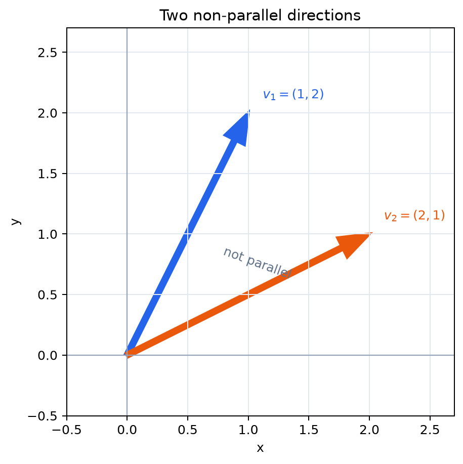

# 一次結合・一次独立・一次従属

- 一次結合を、ベクトルのスカラー倍の和として理解する
- ベクトルの組から作れる範囲と、表し方の重複を区別して考える
- 一次独立を「同じベクトルを二通りに表せない」性質として理解する
- 一次従属を、非自明な一次関係の存在として判定する
- 「張る」と「一次独立」が基底の二つの条件になることを理解する

## なぜ一次結合と一次独立を一緒に考えるのか

手元にあるベクトルを材料として、どのベクトルまで作れるかを知るのが一次結合である。しかし、作れる範囲だけでは、その材料に重複があるかどうかは分からない。

そこで次に、「同じベクトルを異なる係数で作れてしまうことはあるか」を考える。この問いが、そのまま一次独立・一次従属につながる。

## 1. 一次結合――ベクトルを材料として組み合わせる

ベクトル $\boldsymbol{v}_1,\ldots,\boldsymbol{v}_m$ と実数 $c_1,\ldots,c_m$ を用いた

$$
c_1\boldsymbol{v}_1+\cdots+c_m\boldsymbol{v}_m
$$

を、これらのベクトルの**一次結合**という。係数を自由に変えたときに作れるベクトル全体を

$$
\operatorname{span}\{\boldsymbol{v}_1,\ldots,\boldsymbol{v}_m\}
$$

と書き、「$\boldsymbol{v}_1,\ldots,\boldsymbol{v}_m$ が**張る**集合」という。

> **【重要】span は作れるベクトル全体を表す**  
> 「張る」という見方は基底、部分空間、行列の列空間で繰り返し使う。一次結合の係数を自由に動かしたときに到達できる範囲だと考えよう。

## 2. 一つ・二つのベクトルが張るもの

$\boldsymbol{v}\ne\boldsymbol{0}$ に対し、$t\boldsymbol{v}$ を $t\in\mathbb{R}$ の範囲で動かすと、終点は原点を通る直線全体を動く。したがって、一つの零でないベクトルが張るのは**原点を通る直線**である。

平面上の二つのベクトル $\boldsymbol{u},\boldsymbol{v}$ では事情が二つに分かれる。

- 一方が他方のスカラー倍なら、一次結合は同じ直線上にとどまる
- 互いに平行でなければ、$s\boldsymbol{u}+t\boldsymbol{v}$ によって平面全体を表せる

たとえば

$$
\boldsymbol{u}=\begin{pmatrix}1\\0\end{pmatrix},\qquad
\boldsymbol{v}=\begin{pmatrix}1\\1\end{pmatrix}
$$

とすると、任意の $\begin{pmatrix}x\\y\end{pmatrix}$ に対し

$$
s\boldsymbol{u}+t\boldsymbol{v}
=\begin{pmatrix}s+t\\t\end{pmatrix}
$$

だから、$t=y,s=x-y$ とすれば表せる。

## 3. 作れるかどうかと、作り方が一意かどうか

あるベクトル $\boldsymbol{w}$ が $\boldsymbol{v}_1,\ldots,\boldsymbol{v}_m$ の一次結合で表せるかどうかは

$$
c_1\boldsymbol{v}_1+\cdots+c_m\boldsymbol{v}_m=\boldsymbol{w}
$$

を満たす係数が存在するかを調べればよい。

ここで、さらに一歩進めて考える。同じ $\boldsymbol{w}$ に対して

$$
\boldsymbol{w}=c_1\boldsymbol{v}_1+\cdots+c_m\boldsymbol{v}_m
=d_1\boldsymbol{v}_1+\cdots+d_m\boldsymbol{v}_m
$$

という二通りの表し方があったとする。二つの式を引けば

$$
(c_1-d_1)\boldsymbol{v}_1+\cdots+(c_m-d_m)\boldsymbol{v}_m=\boldsymbol{0}
$$

となる。

したがって、**一次結合による表し方が一意かどうかを調べる問題は、零ベクトルを作る一次結合がどれだけあるかを調べる問題に帰着する**。

これが、一次独立の定義で突然零ベクトルを考える理由である。

## 4. 一次独立と一次従属

ベクトル $\boldsymbol{v}_1,\ldots,\boldsymbol{v}_m$ に対して

$$
c_1\boldsymbol{v}_1+\cdots+c_m\boldsymbol{v}_m=\boldsymbol{0}
$$

を考える。これを満たす係数が

$$
c_1=\cdots=c_m=0
$$

だけなら、これらのベクトルは**一次独立**である。

少なくとも一つが0でない係数の組でも零ベクトルを作れるなら、**一次従属**である。係数がすべて0の場合を**自明な関係**、そうでないものを**非自明な関係**という。

> **【最重要】一次独立とは、一次結合の係数に重複がないこと**  
> 零ベクトルを作る方法が「全部0倍」しかなければ、任意のベクトルの一次結合による表し方も一意になる。一次従属なら、同じベクトルを異なる係数で表せる。

## 5. 「余分なベクトルがある」という意味

$\boldsymbol{v}_2=2\boldsymbol{v}_1$ なら

$$
2\boldsymbol{v}_1-\boldsymbol{v}_2=\boldsymbol{0}
$$

という非自明な関係があるので、$\boldsymbol{v}_1,\boldsymbol{v}_2$ は一次従属である。

しかも $\boldsymbol{v}_2$ を取り除いても張る範囲は変わらない。つまり一次従属とは、ベクトルの組の中に「ほかのベクトルから作れてしまう余分な材料」が含まれている状態だと考えられる。

逆に一次独立なら、どのベクトルも残りのベクトルの一次結合では作れない。

## 6. 平面・空間での幾何学的な意味

平面上の二つの零でないベクトルは、平行でなければ一次独立である。異なる二方向への移動を打ち消して零にするには、両方を0倍するしかない。

たとえば

$$
c_1\begin{pmatrix}1\\2\end{pmatrix}
+c_2\begin{pmatrix}2\\1\end{pmatrix}
=\begin{pmatrix}0\\0\end{pmatrix}
$$

*図：二つのベクトルは異なる方向を向くため、一方を他方のスカラー倍では表せない。*

から $c_1+2c_2=0,2c_1+c_2=0$ を得る。解は $c_1=c_2=0$ だけなので、この二つは一次独立である。

3次元空間では、二つのベクトルは同一直線上になければ一次独立である。三つのベクトルは、同一平面上に収まらなければ一次独立である。たとえば

$$
\boldsymbol{v}_3=2\boldsymbol{v}_1-\boldsymbol{v}_2
$$

なら

$$
2\boldsymbol{v}_1-\boldsymbol{v}_2-\boldsymbol{v}_3=\boldsymbol{0}
$$

なので一次従属であり、$\boldsymbol{v}_3$ を除いても張る範囲は変わらない。

## 7. すぐ分かる一次従属

次の場合は必ず一次従属である。

1. 零ベクトルを含む場合
2. 同じベクトルを二つ以上含む場合
3. あるベクトルが他のベクトルの一次結合で表せる場合
4. $N$ 次元空間に $N+1$ 本以上のベクトルがある場合

4は、$N$ 個の独立な方向しかない空間に、それより多くの互いに余分でない方向を置けないことを表す。厳密な証明は連立一次方程式と階数を学んだ後に行う。

## 8. 基本ベクトルと次項への橋渡し

$\mathbb{R}^N$ の基本ベクトル $\boldsymbol{e}_1,\ldots,\boldsymbol{e}_N$ に対して

$$
\boldsymbol{x}=x_1\boldsymbol{e}_1+\cdots+x_N\boldsymbol{e}_N
$$

なので、これらは $\mathbb{R}^N$ 全体を張る。また

$$
c_1\boldsymbol{e}_1+\cdots+c_N\boldsymbol{e}_N
=\begin{pmatrix}c_1\\\vdots\\c_N\end{pmatrix}
=\boldsymbol{0}
$$

ならすべての $c_i$ が0なので、一次独立でもある。

つまり基本ベクトルは

- 空間全体を作れる
- 作り方に重複がない

という二つの性質を同時にもつ。次項では、この「張る」かつ「一次独立」である組を**基底**と呼び、空間を過不足なく表す方法として調べる。

## 確認問題

1. $\begin{pmatrix}7\\-1\end{pmatrix}$ を $\boldsymbol{u}=\begin{pmatrix}1\\1\end{pmatrix}$、$\boldsymbol{v}=\begin{pmatrix}2\\-1\end{pmatrix}$ の一次結合で表せ。
2. $\begin{pmatrix}1\\3\end{pmatrix}$ と $\begin{pmatrix}-2\\-6\end{pmatrix}$ は一次独立か。
3. $\boldsymbol{v}_1=\begin{pmatrix}1\\0\\0\end{pmatrix}$、$\boldsymbol{v}_2=\begin{pmatrix}0\\1\\0\end{pmatrix}$、$\boldsymbol{v}_3=\begin{pmatrix}1\\1\\0\end{pmatrix}$ の非自明な一次関係を一つ示せ。
4. 一次独立なベクトルの組では、同じベクトルを二通りの異なる係数で一次結合として表せないことを説明せよ。

### 解答

1. $\frac53\boldsymbol{u}+\frac83\boldsymbol{v}$
2. 一次従属。後者は前者の $-2$ 倍である。
3. $\boldsymbol{v}_1+\boldsymbol{v}_2-\boldsymbol{v}_3=\boldsymbol{0}$
4. 二つの表示を引くと零ベクトルを作る一次関係になる。一次独立ならその係数はすべて0なので、元の二組の係数は一致する。
