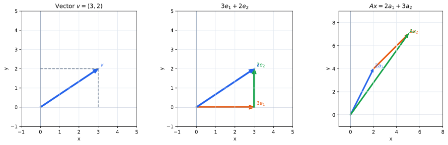

# 第1章 ベクトルと行列――空間を数で表す

この章ではベクトルと行列を同じ流れの中で導入する。最初から抽象的な記号だけを眺めるのではなく、平面上の移動を数で表すところから始めよう。ベクトルを成分で表し、複数のベクトルを列に並べたものとして行列を捉える。

## ベクトルと成分

地図の上で「東へ3 km、北へ2 km進む」という移動を考える。この移動は

$$
\mathbf v=\begin{pmatrix}3\\2\end{pmatrix}
$$

と表せる。上の $3$ は横方向へ3、下の $2$ は縦方向へ2進むことを表している。ベクトルは、このように複数の方向への変化をひとまとめにして扱う道具だと考えられる。

> **定義（ベクトル）**  平面では2個、空間では3個、一般には $N$ 個の成分を縦に並べてベクトルを表す。

$$
\mathbf v=\begin{pmatrix}v_1\\v_2\\\vdots\\v_N\end{pmatrix}.
$$

たとえば

$$
\begin{pmatrix}3\\2\end{pmatrix}+\begin{pmatrix}-1\\4\end{pmatrix}
=\begin{pmatrix}2\\6\end{pmatrix}
$$

は、「東へ3、北へ2」という移動のあとに「西へ1、北へ4」という移動を続けると、全体では「東へ2、北へ6」になることを表す。また

$$
2\begin{pmatrix}3\\2\end{pmatrix}=\begin{pmatrix}6\\4\end{pmatrix}
$$

は同じ向きの移動を2倍に伸ばしている。ベクトルの加法とスカラー倍を成分ごとに定めるのは、こうした幾何学的な操作と一致するからである。

## 基本ベクトルと座標

平面で

$$
\mathbf e_1=\begin{pmatrix}1\\0\end{pmatrix},\qquad
\mathbf e_2=\begin{pmatrix}0\\1\end{pmatrix}
$$

とする。$\mathbf e_1$ は横へ1進む移動、$\mathbf e_2$ は縦へ1進む移動である。すると先ほどのベクトルは

$$
\begin{pmatrix}3\\2\end{pmatrix}=3\mathbf e_1+2\mathbf e_2
$$

と書ける。つまり $(3,2)$ という二つの数は、単なるラベルではなく「$\mathbf e_1$ を3個、$\mathbf e_2$ を2個使う」という組み立て方を記録している。

一般に $\mathbb R^n$ の基本ベクトルを $\mathbf e_1,\ldots,\mathbf e_n$ とすると、任意のベクトルは

$$
\mathbf x=x_1\mathbf e_1+\cdots+x_n\mathbf e_n
$$

と書ける。成分 $x_1,\ldots,x_n$ は、基本ベクトルをどれだけ組み合わせれば $\mathbf x$ になるかを記録した数である。この見方は、あとで「座標とは何か」を考えるときにも重要になる。

## ベクトルを並べて行列をつくる

今度は二つのベクトル

$$
\mathbf a_1=\begin{pmatrix}2\\1\end{pmatrix},\qquad
\mathbf a_2=\begin{pmatrix}-1\\3\end{pmatrix}
$$

を一つにまとめたい。二本を横に並べれば

$$
A=\begin{pmatrix}\mathbf a_1&\mathbf a_2\end{pmatrix}
=\begin{pmatrix}2&-1\\1&3\end{pmatrix}
$$

となる。

> **定義（行列）**  数を長方形に並べたものを行列という。本書ではまず行列を「列ベクトルを束ねたもの」として読む。

この例では $A$ は $2\times2$ 行列で、二本の列ベクトルはどちらも $\mathbb R^2$ のベクトルである。一般に $m\times n$ 行列には $n$ 本の列ベクトルがあり、それぞれは $\mathbb R^m$ のベクトルである。したがって、列数はベクトルの本数、行数は各ベクトルの成分数を表す。

たとえば

$$
B=\begin{pmatrix}1&0\\2&-1\\3&4\end{pmatrix}
$$

は $3\times2$ 行列であり、$\mathbb R^3$ のベクトルを2本束ねたものと読める。

## 行列とベクトルの積

行列を列ベクトルの束として見ると、行列とベクトルの積も自然に定められる。

$$
A=\begin{pmatrix}\mathbf a_1&\cdots&\mathbf a_n\end{pmatrix},\qquad
\mathbf x=\begin{pmatrix}x_1\\\vdots\\x_n\end{pmatrix}
$$

に対して、行列とベクトルの積を次のように定義する。

> **定義（行列とベクトルの積）**
>
> $$
> A\mathbf x=x_1\mathbf a_1+\cdots+x_n\mathbf a_n
> $$

と定める。つまり $A\mathbf x$ は、行列の列を係数 $x_1,\ldots,x_n$ で組み合わせたベクトルである。

> **補足（行列とベクトルの積における入力と出力）**
>
> ここでいう**入力**とは、行列 $A$ に掛けるベクトル $\mathbf x$ のことである。$A\mathbf x$ という式を一つの操作として読むなら、$\mathbf x$ を $A$ に渡すと、それに応じて別のベクトル $A\mathbf x$ が返ってくる。したがって

> $$
> \boxed{\mathbf x\ \longmapsto\ A\mathbf x}
> $$

> という対応において、$\mathbf x$ が入力、$A\mathbf x$ が出力である。たとえば $A$ が平面を90度回転させる行列なら、$\mathbf x$ は「回転させたいベクトル」であり、$A\mathbf x$ は「回転したあとのベクトル」である。「入力」という言葉は単なる比喩ではなく、行列 $A$ をベクトルを受け取って別のベクトルを返す関数として見ることから来ている。

> ここで、式に現れる $A$ と $\mathbf x$ を同じ種類の「与えられた数の集まり」と見るのではなく、**どちらを固定し、どちらを動かして考えているのか**を意識すると、この積の意味が見えやすくなる。

> もっとも基本的なのは、行列 $A$ を固定して、入力ベクトル $\mathbf x$ をいろいろ変える見方である。このとき $A$ の列 $\mathbf a_1,\ldots,\mathbf a_n$ は固定されており、変わるのは係数 $x_1,\ldots,x_n$ である。つまり $A\mathbf x$ は、「固定された列ベクトル $\mathbf a_1,\ldots,\mathbf a_n$ を、入力 $\mathbf x$ の成分に従って組み合わせ、出力を作る操作」と読める。たとえば同じ $A$ に対して
>
> $$
> \mathbf x=\begin{pmatrix}1\\0\end{pmatrix},\qquad
> \begin{pmatrix}0\\1\end{pmatrix},\qquad
> \begin{pmatrix}2\\-1\end{pmatrix}
> $$
>
> と入力を変えれば、同じ二本の列を異なる係数で組み合わせた結果が得られる。第3章で線形変換を考えるときには、この「$A$ は一つの変換として固定し、$\mathbf x$ を動かす」という見方が中心になる。

> 一方で、$\mathbf x=\begin{pmatrix}2\\-1\end{pmatrix}$ を固定して $A$ のほうを変える見方もできる。どの行列 $A=(\mathbf a_1\ \mathbf a_2)$ に対しても $A\mathbf x=2\mathbf a_1-\mathbf a_2$ である。この場合は、行列の列そのものが変わり、そのたびに同じ係数 $2,-1$ で列を組み合わせることになる。行列とベクトルの積という式自体はどちらの見方でも同じだが、何を調べたいかによって「固定するもの」と「変えるもの」は異なる。今後とくに断らない限り、本書ではまず **行列を固定された変換、ベクトルを変化する入力** として読む。

具体的に

$$
A=\begin{pmatrix}2&-1\\1&3\end{pmatrix},\qquad
\mathbf x=\begin{pmatrix}2\\-1\end{pmatrix}
$$

としよう。列を $\mathbf a_1=\begin{pmatrix}2\\1\end{pmatrix}$, $\mathbf a_2=\begin{pmatrix}-1\\3\end{pmatrix}$ と読めば

$$
A\mathbf x
=2\mathbf a_1-\mathbf a_2
=2\begin{pmatrix}2\\1\end{pmatrix}-\begin{pmatrix}-1\\3\end{pmatrix}
=\begin{pmatrix}5\\-1\end{pmatrix}.
$$

ここでは「行と列を掛けて足す」という計算法よりも、**入力ベクトルの成分を係数として、行列の列を組み合わせている**ことに注目してほしい。通常の行列積の計算法は、この操作を成分ごとに書き下したものにすぎない。

特に

$$
A\mathbf e_1=\mathbf a_1,\qquad A\mathbf e_2=\mathbf a_2
$$

である。基本ベクトルを掛けると対応する列がそのまま取り出される。この単純な事実が、第3章で「行列の列は基本ベクトルの行き先である」という中心的な見方につながる。

## $N$ 次元へ

左図では一本のベクトルを成分に分け、中央では同じベクトルを基本ベクトルから組み立てている。右図ではこの組み立て方を行列の列へ移し、入力の成分が各列の係数になることを示している。

人間が直接図に描けるのはせいぜい3次元までだが、ベクトルの考え方そのものはそこで止まらない。たとえばある商品のデータを

$$
\mathbf x=\begin{pmatrix}
120\\
3.5\\
42\\
8
\end{pmatrix}
$$

のように、価格・重量・在庫数・評価など四つの数で表せば、これは $\mathbb R^4$ のベクトルとして扱える。四つの成分を空間内の矢印として思い描く必要はない。それぞれが一つの独立した方向を表す、と考えればよい。

さらに100個の特徴量を持つデータなら $\mathbb R^{100}$ のベクトルになる。高次元を直接図示できなくても、「成分は基準となる方向をどれだけ使うか」「行列は列ベクトルを束ねたもの」「$A\mathbf x$ は列の組み合わせ」という見方はまったく変わらない。線形代数が高次元のデータを扱えるのは、この構造が次元によらないからである。

## この章のまとめ

ベクトルは複数の方向への変化を一つにまとめたものであり、成分は基本ベクトルをどれだけ使うかを表している。行列は列ベクトルを並べたものであり、$A\mathbf x$ は入力の成分を係数としてその列を組み合わせる操作である。とくに行列 $A$ を固定して $\mathbf x$ を動かすと、$A$ は一つの変換、$\mathbf x$ はその変換に与える入力として読める。逆に $\mathbf x$ を固定して $A$ を動かす見方もあり、どちらを固定しているかを意識することが式の意味を理解する助けになる。

特に $A\mathbf e_j$ が第 $j$ 列になるという事実を覚えておこう。次章では、この「ベクトルを組み合わせる」という操作そのものを詳しく調べる。
