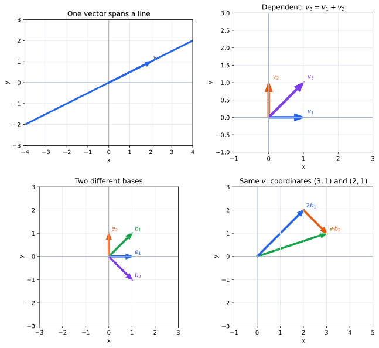

# 第2章 一次結合と基底――変換を決めるのに何本必要か

第1章では、線形変換には重要な性質があることを見た。いくつかのベクトルの行き先が分かれば、それらを組み合わせて作られるベクトルの行き先も自動的に決まる。

では、平面全体の線形変換を決めるためには、どのベクトルの行き先を知ればよいのだろうか。

この問いには二つの条件が隠れている。選んだベクトルから平面上のどのベクトルも作れなければ、変換全体を復元できない。一方、必要以上に多くのベクトルを選ぶと、それらの行き先を自由には決められなくなる。

この章では、この「足りるか」と「余分でないか」を数学的に言い表す。そのために一次結合、張る空間、一次従属、一次独立を導入し、最後に両方の条件をちょうど満たすベクトルの組として基底に到達する。

## 少数のベクトルから平面全体を動かしたい

線形変換 $T:\mathbb R^2\to\mathbb R^2$ を考える。平面には無数のベクトルがあるから、それらの像を一つずつ指定して変換を定めることは現実的ではない。

そこで二本のベクトル

$$
\mathbf v_1=\begin{pmatrix}1\\0\end{pmatrix},\qquad
\mathbf v_2=\begin{pmatrix}0\\1\end{pmatrix}
$$

だけの像を決めてみよう。任意のベクトルは

$$
\begin{pmatrix}x\\y\end{pmatrix}
=x\mathbf v_1+y\mathbf v_2
$$

と書けるので、線形性から

$$
T\begin{pmatrix}x\\y\end{pmatrix}
=xT(\mathbf v_1)+yT(\mathbf v_2)
$$

となる。したがって $T(\mathbf v_1)$ と $T(\mathbf v_2)$ の二本を決めるだけで、平面上のすべてのベクトルの像が決まる。

ここで効いているのは、どんなベクトルも $\mathbf v_1,\mathbf v_2$ をスカラー倍して足すことで作れるという事実である。この「スカラー倍して足す」という操作に名前を付けよう。

> **定義（一次結合）**
>
> ベクトル $\mathbf v_1,\ldots,\mathbf v_k$ とスカラー $c_1,\ldots,c_k$ に対して
>
> $$
> c_1\mathbf v_1+\cdots+c_k\mathbf v_k
> $$
>
> を $\mathbf v_1,\ldots,\mathbf v_k$ の一次結合という。

線形変換が一次結合を保つことは、線形性から

$$
T(c_1\mathbf v_1+\cdots+c_k\mathbf v_k)
=c_1T(\mathbf v_1)+\cdots+c_kT(\mathbf v_k)
$$

と分かる。したがって、選んだベクトルの一次結合として空間内のすべてのベクトルを作れるなら、それらの像だけから変換全体を復元できる。

## そのベクトルだけでどこまで作れるか

では、選んだベクトルから本当に空間全体を作れるかをどう表せばよいだろうか。

一本のベクトル

$$
\mathbf v=\begin{pmatrix}2\\1\end{pmatrix}
$$

だけを選んだとする。この一次結合は

$$
c\mathbf v=\begin{pmatrix}2c\\c\end{pmatrix}
$$

だから、$c$ をどのように変えても原点を通る一本の直線上にしか到達できない。この一本の像を知っても、その直線の外にあるベクトルの像は線形性からは決まらない。

そこで、固定したベクトルの一次結合として作れるベクトルをすべて集める。

> **定義（ベクトルが張る空間）**
>
> $\mathbf v_1,\ldots,\mathbf v_k$ に対して
>
> $$
> \operatorname{span}\{\mathbf v_1,\ldots,\mathbf v_k\}
> =\left\{c_1\mathbf v_1+\cdots+c_k\mathbf v_k\mid c_1,\ldots,c_k\in\mathbb R\right\}
> $$
>
> を $\mathbf v_1,\ldots,\mathbf v_k$ が張る空間という。

したがって

$$
\operatorname{span}\{\mathbf v_1,\ldots,\mathbf v_k\}=\mathbb R^n
$$

であることは、「この $k$ 本のベクトルの像を知れば、線形性によって $\mathbb R^n$ のすべてのベクトルの像を求められる」ということを意味する。

ここで第1章の行列ベクトル積も同じ言葉で読み直せる。行列

$$
A=(\mathbf a_1\ \cdots\ \mathbf a_n)
$$

について

$$
A\mathbf x=x_1\mathbf a_1+\cdots+x_n\mathbf a_n
$$

だから、$\mathbf x$ を自由に動かしたときに $A\mathbf x$ として現れるベクトル全体は、列ベクトル $\mathbf a_1,\ldots,\mathbf a_n$ が張る空間である。

## 多ければ多いほどよいのか

空間全体を作りたいだけなら、ベクトルをたくさん用意すれば安心に思える。しかし、線形変換を少数の情報で記述するという目的では、余分なベクトルは別の問題を起こす。

たとえば

$$
\mathbf v_1=\begin{pmatrix}1\\0\end{pmatrix},\qquad
\mathbf v_2=\begin{pmatrix}0\\1\end{pmatrix},\qquad
\mathbf v_3=\begin{pmatrix}1\\1\end{pmatrix}
$$

を選ぶ。三本あればもちろん平面全体を作れる。しかし

$$
\mathbf v_3=\mathbf v_1+\mathbf v_2
$$

なので、線形変換 $T$ では必ず

$$
T(\mathbf v_3)=T(\mathbf v_1)+T(\mathbf v_2)
$$

でなければならない。

つまり $T(\mathbf v_1)$ と $T(\mathbf v_2)$ を決めた時点で、$T(\mathbf v_3)$ はもう決まっている。三本目の像は新しい情報ではない。それどころか、三本の像を互いに無関係に指定すると、そもそもそれらを実現する線形変換が存在しないことさえある。

たとえば

$$
T(\mathbf v_1)=\begin{pmatrix}1\\0\end{pmatrix},\qquad
T(\mathbf v_2)=\begin{pmatrix}0\\1\end{pmatrix}
$$

としたのに

$$
T(\mathbf v_3)=\begin{pmatrix}0\\0\end{pmatrix}
$$

と指定することはできない。線形性なら $T(\mathbf v_3)=(1,1)^T$ でなければならないからである。

したがって欲しいのは、単に空間全体を作れるベクトルの集まりではない。**空間全体を作るのに十分でありながら、互いの間に余分な関係をもたないベクトルの組**である。

## 余分な関係をどう見つけるか

先ほどの三本には

$$
\mathbf v_1+\mathbf v_2-\mathbf v_3=\mathbf0
$$

という関係がある。係数 $(1,1,-1)$ はすべて0ではないのに、一次結合が零ベクトルになっている。

この形にしておくと、「どれか一本がほかのベクトルから作れる」という関係を一つの条件で検出できる。たとえば

$$
c_1\mathbf v_1+\cdots+c_k\mathbf v_k=\mathbf0
$$

で $c_j\ne0$ なら

$$
\mathbf v_j
=-\sum_{i\ne j}\frac{c_i}{c_j}\mathbf v_i
$$

となり、$\mathbf v_j$ は残りのベクトルから作れてしまう。

そこで次のように定義する。

> **定義（一次独立・一次従属）**
>
> ベクトルの組 $(\mathbf v_1,\ldots,\mathbf v_k)$ について
>
> $$
> c_1\mathbf v_1+\cdots+c_k\mathbf v_k=\mathbf0
> $$
>
> となるのが
>
> $$
> c_1=\cdots=c_k=0
> $$
>
> の場合だけであるとき、この組は**一次独立**であるという。それ以外、すなわち係数がすべて0ではない一次結合で零ベクトルを作れるとき、**一次従属**であるという。

一次従属であるとは、選んだベクトルのどれかがほかから作れてしまい、その一本が新しい情報を担っていないということである。線形変換の記述という観点では、そのベクトルの像を別に指定する必要がない。

## 一次独立なら像を自由に決められる

一次独立が「余分でない」ことを、線形変換の側からもう一度見てみよう。

平面で

$$
\mathbf b_1=\begin{pmatrix}1\\1\end{pmatrix},\qquad
\mathbf b_2=\begin{pmatrix}1\\-1\end{pmatrix}
$$

を選ぶ。この二本は平面全体を張り、しかも一次独立である。

そこで二本の行き先

$$
\mathbf w_1,\mathbf w_2\in\mathbb R^2
$$

を好きに選ぶ。任意の $\mathbf x\in\mathbb R^2$ は

$$
\mathbf x=c_1\mathbf b_1+c_2\mathbf b_2
$$

と表せるので

$$
T(\mathbf x)=c_1\mathbf w_1+c_2\mathbf w_2
$$

と定めたくなる。

ここで重要なのは、係数 $c_1,c_2$ が一通りに決まることである。もし同じ $\mathbf x$ に二通りの表し方

$$
\mathbf x=c_1\mathbf b_1+c_2\mathbf b_2
=d_1\mathbf b_1+d_2\mathbf b_2
$$

があれば、引き算して

$$
(c_1-d_1)\mathbf b_1+(c_2-d_2)\mathbf b_2=\mathbf0
$$

となる。一次独立だから

$$
c_1=d_1,\qquad c_2=d_2
$$

である。

したがって一次独立なベクトルでは、同じベクトルを異なる係数で表す曖昧さがない。空間全体を張ることと組み合わせれば、各ベクトルをちょうど一通りに表せる。

## 足りていて、余分でもない――基底

ここまでで、線形変換を少数のベクトルの像だけで記述するために必要な二つの条件がそろった。

一つ目は、選んだベクトルが空間全体を張ること。これによって、すべてのベクトルの像を復元できる。

二つ目は、選んだベクトルが一次独立であること。これによって、ベクトル同士に余分な関係がなく、それぞれの像を独立に指定できる。

この二条件を満たす組に名前を付ける。

> **定義（基底）**
>
> ベクトルの組 $(\mathbf b_1,\ldots,\mathbf b_n)$ が空間全体を張り、しかも一次独立であるとき、この組をその空間の**基底**という。

基底とは、空間を記述するための「過不足のないベクトルの組」である。

たとえば $\mathbb R^2$ の標準基底

$$
\mathbf e_1=\begin{pmatrix}1\\0\end{pmatrix},\qquad
\mathbf e_2=\begin{pmatrix}0\\1\end{pmatrix}
$$

は基底である。しかし基底はこれだけではない。先ほどの

$$
\mathbf b_1=\begin{pmatrix}1\\1\end{pmatrix},\qquad
\mathbf b_2=\begin{pmatrix}1\\-1\end{pmatrix}
$$

も $\mathbb R^2$ の基底である。

線形変換は、基底の各ベクトルの像を任意に指定すればただ一つ定まる。これこそ、一次結合・一次独立・基底を導入したかった理由である。

## 基底を選ぶとベクトルを数で記録できる

基底 $\mathcal B=(\mathbf b_1,\ldots,\mathbf b_n)$ を選ぶと、任意のベクトル $\mathbf v$ は

$$
\mathbf v=c_1\mathbf b_1+\cdots+c_n\mathbf b_n
$$

とただ一通りに表せる。この係数を並べた

$$
[\mathbf v]_{\mathcal B}
=\begin{pmatrix}c_1\\\vdots\\c_n\end{pmatrix}
$$

を、基底 $\mathcal B$ に関する $\mathbf v$ の座標という。

> **定義（座標）**
>
> 基底 $\mathcal B=(\mathbf b_1,\ldots,\mathbf b_n)$ に対して
>
> $$
> \mathbf v=c_1\mathbf b_1+\cdots+c_n\mathbf b_n
> $$
>
> と表したときの係数ベクトル $[\mathbf v]_{\mathcal B}=(c_1,\ldots,c_n)^T$ を、$\mathcal B$ に関する $\mathbf v$ の座標という。

たとえば

$$
\mathbf v=\begin{pmatrix}3\\1\end{pmatrix}
$$

は標準基底では

$$
\mathbf v=3\mathbf e_1+\mathbf e_2
$$

だから座標は $(3,1)^T$ である。一方

$$
\mathbf b_1=\begin{pmatrix}1\\1\end{pmatrix},\qquad
\mathbf b_2=\begin{pmatrix}1\\-1\end{pmatrix}
$$

を基底にすれば

$$
\mathbf v=2\mathbf b_1+\mathbf b_2
$$

だから

$$
[\mathbf v]_{\mathcal B}=\begin{pmatrix}2\\1\end{pmatrix}.
$$

ベクトルそのものと座標は同じものではない。座標は、選んだ基底をどれだけずつ使えばそのベクトルになるかを記録した数である。

## 次元――何本あれば足りるのか

$\mathbb R^2$ の基底は二本、$\mathbb R^3$ の基底は三本からなる。基底そのものはさまざまに選べるが、その本数は変わらない。

> **定義（次元）**
>
> 空間の基底を構成するベクトルの本数を、その空間の**次元**という。特に
>
> $$
> \dim\mathbb R^n=n.
> $$

次元は、「その空間のすべてのベクトルを過不足なく記述するには、独立なベクトルが何本必要か」を表している。

この意味で、$n$ 次元空間で線形変換を完全に指定するには、基底を選べば $n$ 本のベクトルの行き先を指定すれば十分である。

図では、一本のベクトルでは平面全体に届かないこと、一次従属な三本には余分な一本があること、平面には異なる基底を選べることを比較している。

## 行列とのつながり

行列

$$
A=(\mathbf a_1\ \cdots\ \mathbf a_n)
$$

の列について

$$
A\mathbf x=\mathbf0
$$

と書くと、これは

$$
x_1\mathbf a_1+\cdots+x_n\mathbf a_n=\mathbf0
$$

という関係そのものである。したがって

$$
A\mathbf x=\mathbf0
$$

が $\mathbf x=\mathbf0$ しか解をもたないことと、$A$ の列ベクトルが一次独立であることは同じである。

また、$A\mathbf x$ として得られるベクトル全体は列ベクトルが張る空間である。したがって行列を見るときには、二つの問いを区別するとよい。

1. 列の一次結合で、どこまでのベクトルに到達できるか。
2. 同じベクトルに、異なる係数ベクトルが対応してしまわないか。

前者は「張る空間」、後者は「一次独立性」の問題である。この二つは、第II部で連立一次方程式を考えるとき、それぞれ「解が存在するか」と「解が一意か」という問題として再び現れる。

## この章のまとめ

線形変換を空間内のすべてのベクトルについて一つずつ指定する必要はない。選んだベクトルが空間全体を張っていれば、それらの像から線形性によって変換全体を復元できる。

しかし、選ぶベクトルが一次従属なら、その中にはほかのベクトルから作れるものがあり、その像も自由には指定できない。そこで、空間全体を張り、しかも一次独立な「過不足のない組」として基底が必要になる。

基底を選べば、各ベクトルは基底の一次結合としてただ一通りに表され、その係数が座標になる。そして線形変換は、基底の各ベクトルの行き先を指定するだけで完全に決まる。

次章では、この結論を使って線形変換を改めて調べる。特に、基底の行き先をどのように行列へ記録するのか、二つの線形変換を続けて作用させると行列の積がなぜ現れるのか、そして変換を元に戻せるとはどういうことかを考える。