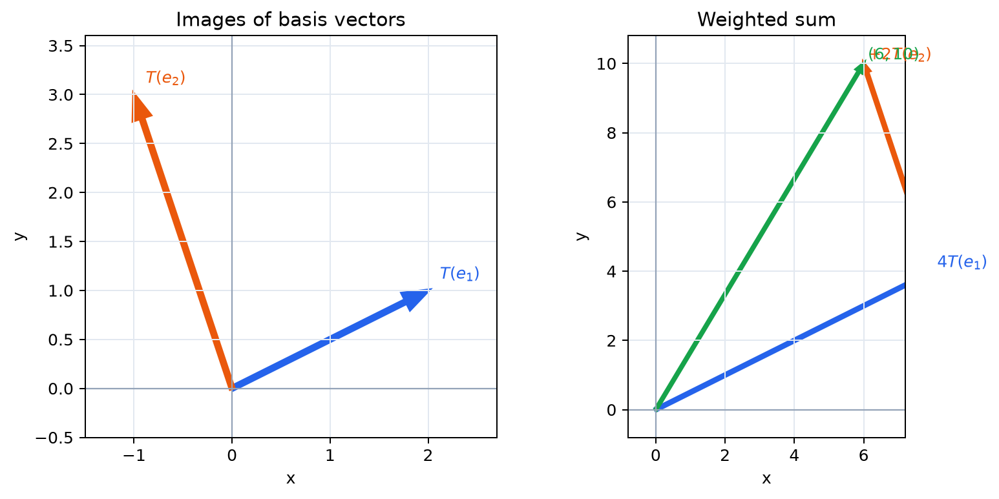

# 基本ベクトルの移り先で変換を決める

- 任意のベクトルを基本ベクトルの一次結合として読む
- 線形変換が基本ベクトルの移り先だけで決まることを理解する
- 変換後のベクトルを、移り先の一次結合として求める
- 基本ベクトルの移り先を列に並べる理由を説明する
- 2次元の考え方を $N$ 次元へ一般化する

## この項で先に使う考え方

この章では、まず最も重要な見方を手に入れ、次項以降で用語と条件を詳しく整える。

ベクトルを別のベクトルへ移す規則を**変換**といい、$T$ と書く。そのうち、ベクトルの和とスカラー倍を保つ変換、すなわち

$$
T(\boldsymbol{u}+\boldsymbol{v})=T(\boldsymbol{u})+T(\boldsymbol{v}),\qquad
T(c\boldsymbol{u})=cT(\boldsymbol{u})
$$

を満たすものを**線形変換**という。この二条件の詳しい意味や判定方法は第3項で扱う。ここでは、二条件から得られる「一次結合をそのまま変換後へ移せる」という働きに注目する。

## なぜ基本ベクトルの移り先を見るのか

線形変換を、あらゆるベクトルについて逐一記述する必要をなくすためである。任意のベクトルは基本ベクトルの一次結合なので、各基本ベクトルの移り先だけを記録すれば、変換全体を復元できる。

この見方を章の最初に置くのは、以後に登場する写像、線形性、具体的な変形、核と像を、すべて「基本ベクトルがどこへ移るか」から考えられるようにするためである。

## 1. 任意のベクトルを分解する

平面では

$$
\begin{pmatrix}x\\y\end{pmatrix}
=x\boldsymbol{e}_1+y\boldsymbol{e}_2
$$

である。$T$ が線形なら

$$
T\left(\begin{pmatrix}x\\y\end{pmatrix}\right)
=xT(\boldsymbol{e}_1)+yT(\boldsymbol{e}_2).
$$

したがって、$T(\boldsymbol{e}_1)$ と $T(\boldsymbol{e}_2)$ が分かれば、すべてのベクトルの移り先が分かる。

> **【最重要】第 $j$ 列は $\boldsymbol{e}_j$ の移り先**  
> 行列の積、合成、逆行列など本書の以後の内容を一貫して理解する中心的な見方なので、列と基本ベクトルの対応を覚えよう。

## 2. 具体例

$$
T(\boldsymbol{e}_1)=\begin{pmatrix}2\\1\end{pmatrix},\qquad
T(\boldsymbol{e}_2)=\begin{pmatrix}-1\\3\end{pmatrix}
$$

*図：入力の各成分を、対応する基本ベクトルの移り先の重みとして使う。*

とする。このとき

$$
T\left(\begin{pmatrix}4\\2\end{pmatrix}\right)
=4\begin{pmatrix}2\\1\end{pmatrix}
+2\begin{pmatrix}-1\\3\end{pmatrix}
=\begin{pmatrix}6\\10\end{pmatrix}.
$$

入力の第1成分は第1基本ベクトルの移り先に掛かり、第2成分は第2基本ベクトルの移り先に掛かる。

## 3. なぜ列に並べるのか

二つの移り先を横に並べると

$$
\begin{pmatrix}
2&-1\\
1&3
\end{pmatrix}
$$

となる。これを入力ベクトルに作用させる計算を

$$
\begin{pmatrix}2&-1\\1&3\end{pmatrix}
\begin{pmatrix}x\\y\end{pmatrix}
=x\begin{pmatrix}2\\1\end{pmatrix}
+y\begin{pmatrix}-1\\3\end{pmatrix}
$$

と定める。これが行列とベクトルの積である。

> **【最重要】第 $i$ 列は $\boldsymbol{e}_i$ の移り先である**  
> 第1列は $T(\boldsymbol{e}_1)$、第2列は $T(\boldsymbol{e}_2)$ を表す。行列を数表としてではなく、基本ベクトルの移り先を束ねたものとして読む習慣をつけよう。

## 4. 格子全体の変形

平面の縦横の格子線は、$\boldsymbol{e}_1,\boldsymbol{e}_2$ に平行である。線形変換後は、それぞれ $T(\boldsymbol{e}_1),T(\boldsymbol{e}_2)$ に平行な格子線へ移る。

基本ベクトルが平行でない二方向へ移れば平面は斜めの格子に変形する。二つの移り先が同一直線上に重なると、平面全体がその直線へ押しつぶされる。

## 5. 空間の場合

$\mathbb{R}^3$ では

$$
\boldsymbol{x}=x\boldsymbol{e}_1+y\boldsymbol{e}_2+z\boldsymbol{e}_3
$$

なので

$$
T(\boldsymbol{x})=xT(\boldsymbol{e}_1)+yT(\boldsymbol{e}_2)+zT(\boldsymbol{e}_3).
$$

三つの移り先を列に並べれば、3列をもつ行列になる。出力が $\mathbb{R}^M$ にあるなら、各列は $M$ 成分をもち、行列は $M$ 行3列となる。

## 6. $N$ 次元への一般化

$T:\mathbb{R}^N\to\mathbb{R}^M$ に対し、$N$ 個のベクトル

$$
T(\boldsymbol{e}_1),\ldots,T(\boldsymbol{e}_N)
$$

を自由に指定すれば、線形性によって $T$ 全体がただ一つに決まる。それらを列に並べた $M\times N$ 行列が、$T$ を表す行列になる。

## 確認問題

1. $T(\boldsymbol{e}_1)=\begin{pmatrix}1\\2\end{pmatrix}$、$T(\boldsymbol{e}_2)=\begin{pmatrix}3\\-1\end{pmatrix}$ のとき、$T\left(\begin{pmatrix}-2\\4\end{pmatrix}\right)$ を求めよ。
2. 行列 $\begin{pmatrix}0&2\\-1&3\end{pmatrix}$ が表す変換で、$\boldsymbol{e}_1,\boldsymbol{e}_2$ はそれぞれどこへ移るか。
3. $M\times N$ 行列の列が $N$ 本あり、各列が $M$ 成分である理由を説明せよ。

### 解答

1. $\begin{pmatrix}10\\-8\end{pmatrix}$
2. $\boldsymbol{e}_1\mapsto\begin{pmatrix}0\\-1\end{pmatrix}$、$\boldsymbol{e}_2\mapsto\begin{pmatrix}2\\3\end{pmatrix}$
3. 入力側には $N$ 個の基本ベクトルがあり、それぞれの移り先は $\mathbb{R}^M$ のベクトルだから。
