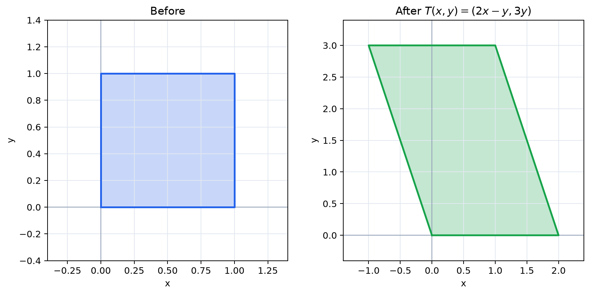
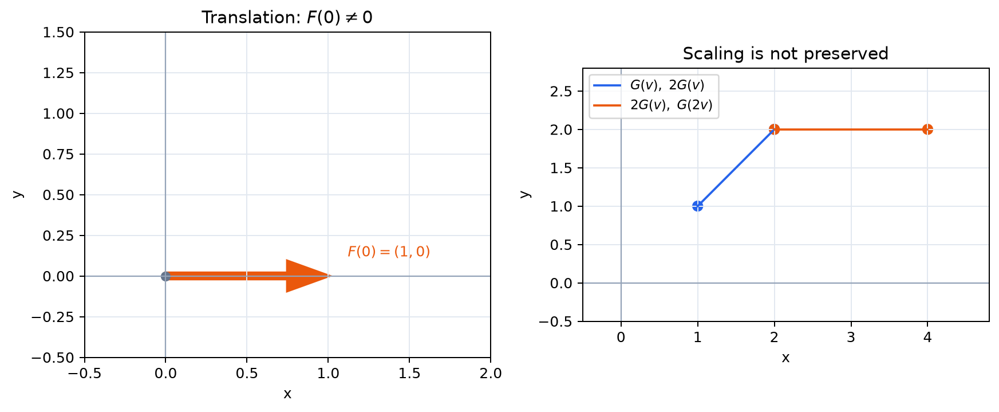

# 線形性とは何か

- 線形性を、加法とスカラー倍を保つ性質として理解する
- 線形性の二条件を式と図形の両方で説明する
- 線形変換が原点を原点へ移すことを導く
- 線形な写像と線形でない写像を判別する
- 一次結合が変換の前後で保たれることを理解する

第1項では、基本ベクトルの移り先だけで変換全体が決まるという結論を先に見た。この項では、その結論を可能にする線形性を正式に定義し、なぜ一次結合が保たれるのかを確かめる。

## なぜ線形性を考えるのか

すべての入力を個別に調べず、少数の基本的な入力の結果から変換全体を知るためである。加法とスカラー倍を保つ変換なら、ベクトルの分解をそのまま変換後へ移せるので、行列による統一的な計算が可能になる。

## 1. 二つの条件

ベクトル空間からベクトル空間への写像 $T$ が、すべてのベクトル $\boldsymbol{u},\boldsymbol{v}$ とスカラー $c$ に対して

$$
T(\boldsymbol{u}+\boldsymbol{v})=T(\boldsymbol{u})+T(\boldsymbol{v})
$$

および

$$
T(c\boldsymbol{u})=cT(\boldsymbol{u})
$$

を満たすとき、$T$ を**線形変換**または**線形写像**という。第一の条件を加法性、第二の条件を斉次性という。

## 2. 幾何的な意味

加法性は、二つの移動を続けてから変換しても、それぞれを変換してから続けても同じだという意味である。したがって、ベクトルの加法を表す平行四辺形は変換後も平行四辺形になる。ただし、押しつぶされて線分になる場合はある。

斉次性は、同一直線上の倍率を保つことを意味する。$2\boldsymbol{v}$ は $\boldsymbol{v}$ の2倍なので、変換後も $T(2\boldsymbol{v})=2T(\boldsymbol{v})$ となる。

## 3. 一次結合を保つ

二条件を合わせると

$$
T(c_1\boldsymbol{v}_1+\cdots+c_m\boldsymbol{v}_m)
=c_1T(\boldsymbol{v}_1)+\cdots+c_mT(\boldsymbol{v}_m)
$$

が成り立つ。

> **【最重要】線形変換は一次結合を保つ**  
> この性質により、第1項で見たように、基底ベクトルの移り先だけで任意のベクトルの移り先が決まる。本書の行列の見方を支える中心的な式なので、意味とともに覚えよう。

## 4. 原点は動かない

線形変換では

$$
T(\boldsymbol{0})=T(0\boldsymbol{v})=0T(\boldsymbol{v})=\boldsymbol{0}
$$

である。したがって原点を別の点へ移す平行移動は線形変換ではない。

また、$T(-\boldsymbol{v})=-T(\boldsymbol{v})$ も成り立つ。

## 5. 線形変換の例

$$
T\left(\begin{pmatrix}x\\y\end{pmatrix}\right)
=\begin{pmatrix}2x-y\\3y\end{pmatrix}
$$

*図：この変換では、ベクトルの和とスカラー倍を変換の前後どちらで行っても結果が一致する。*

は線形変換である。実際、各出力成分が入力成分の定数倍の和であり、定数項を含まない。この形の写像は加法とスカラー倍を保つ。

回転、原点を通る直線に関する鏡映、拡大・縮小、せん断、原点を通る部分空間への射影も線形変換である。

## 6. 線形でない例

次の写像は線形ではない。

$$
F\left(\begin{pmatrix}x\\y\end{pmatrix}\right)
=\begin{pmatrix}x+1\\y\end{pmatrix}
$$

は $F(\boldsymbol{0})\ne\boldsymbol{0}$ である。また

$$
G\left(\begin{pmatrix}x\\y\end{pmatrix}\right)
=\begin{pmatrix}x^2\\y\end{pmatrix}
$$

*図：$F$ は原点を保たず、$G$ はスカラー倍を保たないため、どちらも線形ではない。*

では一般に $G(2\boldsymbol{v})\ne2G(\boldsymbol{v})$ となる。

ただし、原点を原点へ移すだけでは線形性の十分条件ではない。必ず二条件を確認する必要がある。

## 7. $N$ 次元でも同じ定義

$T:\mathbb{R}^N\to\mathbb{R}^M$ でも、加法性と斉次性が線形性の定義である。入力と出力の次元は等しくなくてもよい。高次元で図示できなくても、一次結合を保つという意味は変わらない。

## 確認問題

1. $T(x,y)=(x+2y,3x)$ が線形であることを二条件から確かめよ。
2. $F(x,y)=(x,y+4)$ が線形でないことを最も簡単に示せ。
3. 線形変換 $T$ について $T(2\boldsymbol{u}-3\boldsymbol{v})$ を書き換えよ。

### 解答

1. 成分ごとに計算すると、加法性と斉次性の両方を満たす。
2. $F(\boldsymbol{0})=(0,4)\ne\boldsymbol{0}$ である。
3. $2T(\boldsymbol{u})-3T(\boldsymbol{v})$
