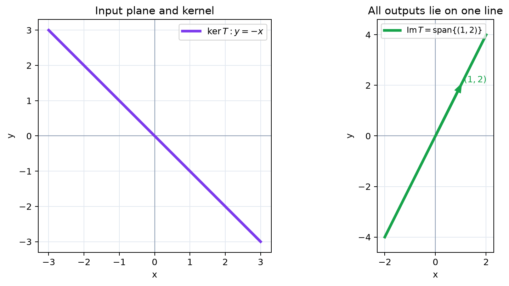

# 核と像

- 核を、零ベクトルへ移る入力全体として理解する
- 像を、実際に到達できる出力全体として理解する
- 核と像がそれぞれ部分空間になることを確かめる
- 核を「失われる方向」、像を「残る出力方向」として捉える
- 核・像と変換の一対一性、次元の関係への見通しをもつ

## なぜ核と像を考えるのか

線形変換がどの情報を失い、どの出力を作れるかを、集合として正確に捉えるためである。核を調べれば異なる入力が同じ出力になる原因が分かり、像を調べれば変換が到達できる範囲が分かる。

## 1. 零へ押しつぶされるベクトル

線形写像 $T:V\to W$ に対して

$$
\ker T=\{\boldsymbol{x}\in V\mid T(\boldsymbol{x})=\boldsymbol{0}\}
$$

を $T$ の**核**という。kernel の頭文字から $\ker T$ と書く。

核は、変換によって情報が完全に失われる方向を表す。

> **【重要】核は失われる入力、像は到達できる出力**  
> この対比は一対一性、階数、次元定理、連立一次方程式の解を結びつけるため、定義式と直観の両方を覚えておこう。

## 2. 射影の核

$$
P\left(\begin{pmatrix}x\\y\end{pmatrix}\right)
=\begin{pmatrix}x\\0\end{pmatrix}
$$

を考える。$P(\boldsymbol{x})=\boldsymbol{0}$ となるのは $x=0$ のときなので

$$
\ker P=\left\{\begin{pmatrix}0\\t\end{pmatrix}\middle|t\in\mathbb{R}\right\}.
$$

つまり $y$ 軸方向はすべて零へ押しつぶされる。

## 3. 到達できる出力

線形写像の出力全体

$$
\operatorname{Im}T=\{T(\boldsymbol{x})\mid\boldsymbol{x}\in V\}
$$

を $T$ の**像**という。上の射影 $P$ では

$$
\operatorname{Im}P=\left\{\begin{pmatrix}s\\0\end{pmatrix}\middle|s\in\mathbb{R}\right\}
$$

であり、$x$ 軸全体である。

行列の見方では、像は列ベクトルの一次結合で作れる範囲である。すなわち、**像は各基本ベクトルの移り先が張る空間**である。

## 4. 核と像は部分空間

$\boldsymbol{u},\boldsymbol{v}\in\ker T$ なら

$$
T(a\boldsymbol{u}+b\boldsymbol{v})
=aT(\boldsymbol{u})+bT(\boldsymbol{v})=\boldsymbol{0}
$$

なので、$a\boldsymbol{u}+b\boldsymbol{v}$ も核に属する。核は加法とスカラー倍について閉じている。同様に像も一次結合について閉じている。したがって、核と像はいずれもベクトル空間の一部として振る舞う**部分空間**である。

## 5. 一対一性と核

異なる二つの入力が同じ出力へ移るとする。

$$
T(\boldsymbol{u})=T(\boldsymbol{v})
$$

なら、線形性から

$$
T(\boldsymbol{u}-\boldsymbol{v})=\boldsymbol{0}
$$

である。したがって、核に零ベクトル以外があると、異なる入力を区別できない。逆に

$$
\ker T=\{\boldsymbol{0}\}
$$

なら $T$ は一対一である。

> **【重要】核は失われる方向、像は到達できる方向**  
> 核が大きいほど多くの入力情報が失われ、像の次元は小さくなる。この関係は後に「次元定理」として $\dim(\ker T)+\dim(\operatorname{Im}T)=\dim V$ と表される。

## 6. 例：平面を直線へ押しつぶす

$$
T\left(\begin{pmatrix}x\\y\end{pmatrix}\right)
=\begin{pmatrix}x+y\\2x+2y\end{pmatrix}
$$

*図：入力平面は像の直線へ押しつぶされ、核の方向は零ベクトルに重なる。*

とする。出力は常に $\begin{pmatrix}1\\2\end{pmatrix}$ の倍数なので

$$
\operatorname{Im}T=\operatorname{span}\left\{\begin{pmatrix}1\\2\end{pmatrix}\right\}.
$$

一方、$x+y=0$ なら零へ移るので

$$
\ker T=\operatorname{span}\left\{\begin{pmatrix}1\\-1\end{pmatrix}\right\}.
$$

平面のうち一方向が失われ、残る一方向だけが像になる。

## 7. $N$ 次元の場合

$T:\mathbb{R}^N\to\mathbb{R}^M$ でも定義は同じである。核は入力空間 $\mathbb{R}^N$ の部分空間、像は出力空間 $\mathbb{R}^M$ の部分空間である。核を求めることは同次方程式 $T(\boldsymbol{x})=\boldsymbol{0}$ を解くことであり、像を求めることは基本ベクトルの移り先が張る範囲を調べることである。

## 8. 第2章のまとめ

線形変換は加法とスカラー倍を保つ写像であり、一次結合を保つ。そのため、基底ベクトルの移り先だけで変換全体が決まる。移り先を列に並べたものが行列である。

次章では、この行列を独立した計算対象として詳しく調べ、列の見方から行列とベクトルの積、行列の積、逆行列へ進む。

## 確認問題

1. $T(x,y,z)=(x,y)$ の核と像を求めよ。
2. $T:\mathbb{R}^2\to\mathbb{R}^2$ の二本の列が一次独立なら、像は何か。
3. 核が $\{\boldsymbol{0}\}$ だけなら、なぜ異なる入力が同じ出力にならないのか。

### 解答

1. $\ker T=\{(0,0,z)\mid z\in\mathbb{R}\}$、$\operatorname{Im}T=\mathbb{R}^2$
2. $\mathbb{R}^2$ 全体
3. 同じ出力なら差が核に入るが、核が零だけなら入力の差も零となるから。
