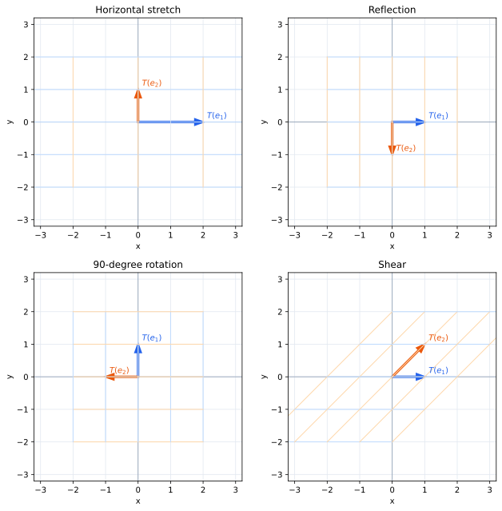
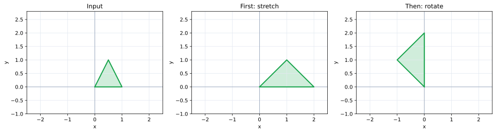
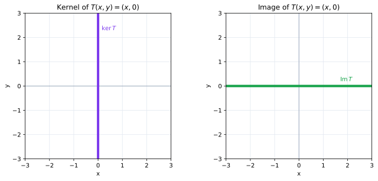
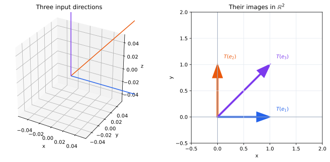

# 第3章 線形変換――基底の行き先を行列に記録する

第1章では、平面全体の変換を少数の情報で記述したいという問題から線形変換を導入した。第2章では、そのために必要な「過不足のないベクトルの組」が基底であることを確かめた。

ここでようやく、線形変換を記述するために本当に必要な情報がはっきりした。

**線形変換は、基底の各ベクトルをどこへ写すかを指定すれば完全に決まる。**

この章では、この事実を出発点として、基底の行き先を行列として記録する。さらに、変換を足す、続けて作用させる、元に戻すという操作から、行列の和、行列の積、単位行列、逆行列がなぜ必要になるのかを考える。

## 基底の行き先だけで変換全体が決まる

$\mathbb R^2$ の標準基底

$$
\mathbf e_1=\begin{pmatrix}1\\0\end{pmatrix},\qquad
\mathbf e_2=\begin{pmatrix}0\\1\end{pmatrix}
$$

を考える。第2章で見たように、これは平面全体を張り、しかも一次独立である。

この二本の行き先を

$$
T(\mathbf e_1)=\begin{pmatrix}2\\1\end{pmatrix},\qquad
T(\mathbf e_2)=\begin{pmatrix}-1\\1\end{pmatrix}
$$

と指定しよう。

任意のベクトル

$$
\mathbf x=\begin{pmatrix}x\\y\end{pmatrix}
$$

は

$$
\mathbf x=x\mathbf e_1+y\mathbf e_2
$$

とただ一通りに表される。したがって線形性から

$$
T(\mathbf x)
=xT(\mathbf e_1)+yT(\mathbf e_2)
=x\begin{pmatrix}2\\1\end{pmatrix}
+y\begin{pmatrix}-1\\1\end{pmatrix}.
$$

たとえば

$$
\mathbf x=\begin{pmatrix}3\\2\end{pmatrix}
$$

なら

$$
T(\mathbf x)
=3\begin{pmatrix}2\\1\end{pmatrix}
+2\begin{pmatrix}-1\\1\end{pmatrix}
=\begin{pmatrix}4\\5\end{pmatrix}.
$$

ここで第2章の二つの条件が効いている。基底が空間全体を張るから、どの $\mathbf x$ についても像を求められる。そして基底が一次独立だから、$\mathbf x$ を表す係数が一意であり、$T(\mathbf x)$ の定め方に曖昧さがない。

一般に、基底 $\mathcal B=(\mathbf b_1,\ldots,\mathbf b_n)$ に対して

$$
\mathbf x=c_1\mathbf b_1+\cdots+c_n\mathbf b_n
$$

なら

$$
T(\mathbf x)=c_1T(\mathbf b_1)+\cdots+c_nT(\mathbf b_n).
$$

したがって、線形変換は基底の像 $T(\mathbf b_1),\ldots,T(\mathbf b_n)$ を指定すればただ一つ定まる。

## 標準基底の行き先を行列にする

標準基底を使う場合、先ほどの二本の像をその順に列として並べる。

$$
A=
\begin{pmatrix}
2&-1\\
1&1
\end{pmatrix}
=
\begin{pmatrix}T(\mathbf e_1)&T(\mathbf e_2)\end{pmatrix}.
$$

> **定義（線形変換を表す行列）**
>
> 線形変換 $T:\mathbb R^n\to\mathbb R^m$ に対して、標準基底 $\mathbf e_1,\ldots,\mathbf e_n$ の像を列に並べた
>
> $$
> A=\begin{pmatrix}T(\mathbf e_1)&\cdots&T(\mathbf e_n)\end{pmatrix}
> $$
>
> を、標準基底に関して $T$ を表す行列という。

第 $j$ 列は、そのまま第 $j$ 基本ベクトルの行き先である。

任意の

$$
\mathbf x=x_1\mathbf e_1+\cdots+x_n\mathbf e_n
$$

に対して

$$
T(\mathbf x)
=x_1T(\mathbf e_1)+\cdots+x_nT(\mathbf e_n)
$$

だから、行列とベクトルの積

$$
A\mathbf x
=x_1\mathbf a_1+\cdots+x_n\mathbf a_n
$$

は、まさに線形変換による像を計算する操作である。ここで $\mathbf a_j=T(\mathbf e_j)$ は $A$ の第 $j$ 列である。

したがって

$$
\boxed{T(\mathbf x)=A\mathbf x}
$$

と書ける。

行列ベクトル積は、成分を機械的に掛けて足すために導入されたのではない。**基底への分解を、基底の行き先へそのまま移す操作**として現れたのである。

## 具体的な線形変換を行列にする

行列を作るときは、変換の式を暗記するより、基本ベクトルがどこへ行くかを見るほうが本質的である。

横方向を2倍、縦方向を3倍にする変換では

$$
\mathbf e_1\mapsto\begin{pmatrix}2\\0\end{pmatrix},\qquad
\mathbf e_2\mapsto\begin{pmatrix}0\\3\end{pmatrix}
$$

だから

$$
A=\begin{pmatrix}2&0\\0&3\end{pmatrix}.
$$

$x$ 軸について鏡映するなら

$$
\mathbf e_1\mapsto\mathbf e_1,\qquad
\mathbf e_2\mapsto-\mathbf e_2
$$

なので

$$
A=\begin{pmatrix}1&0\\0&-1\end{pmatrix}.
$$

横方向へのせん断

$$
\begin{pmatrix}x\\y\end{pmatrix}
\mapsto
\begin{pmatrix}x+y\\y\end{pmatrix}
$$

では

$$
\mathbf e_1\mapsto\begin{pmatrix}1\\0\end{pmatrix},\qquad
\mathbf e_2\mapsto\begin{pmatrix}1\\1\end{pmatrix}
$$

だから

$$
A=\begin{pmatrix}1&1\\0&1\end{pmatrix}.
$$

角 $\theta$ の回転では

$$
\mathbf e_1\mapsto\begin{pmatrix}\cos\theta\\\sin\theta\end{pmatrix},\qquad
\mathbf e_2\mapsto\begin{pmatrix}-\sin\theta\\\cos\theta\end{pmatrix}
$$

なので

$$
R_\theta=
\begin{pmatrix}
\cos\theta&-\sin\theta\\
\sin\theta&\cos\theta
\end{pmatrix}.
$$

この公式を暗記する必要はない。二本の列が基本ベクトルを回転させた結果であることから、その場で再構成できる。

## 行列の和とスカラー倍

二つの線形変換 $S,T$ があるとき、同じベクトル $\mathbf x$ にそれぞれを作用させ、その二つの像を足す新しい変換を考えられる。

$$
(S+T)(\mathbf x)=S(\mathbf x)+T(\mathbf x).
$$

$S,T$ をそれぞれ行列 $A,B$ で表すなら

$$
(S+T)(\mathbf x)=A\mathbf x+B\mathbf x=(A+B)\mathbf x.
$$

したがって行列の和は、線形変換の像を足す操作を表す。

同様に

$$
(cT)(\mathbf x)=cT(\mathbf x)
$$

を行列で表せば

$$
(cA)\mathbf x=c(A\mathbf x)
$$

となる。行列の成分ごとの加法やスカラー倍は、線形変換そのものの加法とスカラー倍を記録したものなのである。

## 二つの変換を続けると何が起こるか

次に、二つの線形変換を順番に作用させたい。

まず

$$
B=\begin{pmatrix}2&0\\0&1\end{pmatrix}
$$

で横方向を2倍にし、その後

$$
A=\begin{pmatrix}0&-1\\1&0\end{pmatrix}
$$

で90度回転するとする。

ベクトル $\mathbf x$ は

$$
\mathbf x\xmapsto{B}B\mathbf x\xmapsto{A}A(B\mathbf x)
$$

と移る。この二段階の変換も線形変換である。ならば、これも一つの行列で記録できるはずである。

ここで第2章の考え方をもう一度使う。合成変換を表す行列を知りたければ、標準基底の行き先だけを調べればよい。

$B$ の第 $j$ 列を $\mathbf b_j$ とすると

$$
B\mathbf e_j=\mathbf b_j.
$$

その後 $A$ を作用させるので

$$
\mathbf e_j
\xmapsto{B}\mathbf b_j
\xmapsto{A}A\mathbf b_j.
$$

したがって、合成変換の第 $j$ 列は $A\mathbf b_j$ である。

> **定義（行列の積）**
>
> $B$ による変換の後に $A$ による変換を行う合成変換を表す行列を $AB$ と書く。すなわち
>
> $$
> (AB)\mathbf x=A(B\mathbf x)
> $$
>
> であり、$B=(\mathbf b_1\ \cdots\ \mathbf b_n)$ なら
>
> $$
> AB=\begin{pmatrix}A\mathbf b_1&\cdots&A\mathbf b_n\end{pmatrix}.
> $$

これが行列積の意味である。

## 行列積の計算法

$A=(a_{ik})$ が $m\times p$ 行列、$B=(b_{kj})$ が $p\times n$ 行列とする。$B$ の第 $j$ 列は

$$
\mathbf b_j=
\begin{pmatrix}
b_{1j}\\
\vdots\\
b_{pj}
\end{pmatrix}
$$

だから

$$
A\mathbf b_j
=b_{1j}\mathbf a_1+\cdots+b_{pj}\mathbf a_p.
$$

このベクトルの第 $i$ 成分は

$$
(AB)_{ij}
=a_{i1}b_{1j}+\cdots+a_{ip}b_{pj}
=\sum_{k=1}^{p}a_{ik}b_{kj}.
$$

これが「$A$ の第 $i$ 行と $B$ の第 $j$ 列を掛けて足す」という計算法の由来である。

先ほどの例では

$$
B=\begin{pmatrix}2&0\\0&1\end{pmatrix}
$$

の列を $A$ で変換すると

$$
A\begin{pmatrix}2\\0\end{pmatrix}=\begin{pmatrix}0\\2\end{pmatrix},\qquad
A\begin{pmatrix}0\\1\end{pmatrix}=\begin{pmatrix}-1\\0\end{pmatrix}
$$

だから

$$
AB=\begin{pmatrix}0&-1\\2&0\end{pmatrix}.
$$

一方、順序を逆にすると

$$
BA=\begin{pmatrix}0&-2\\1&0\end{pmatrix}
$$

となる。一般に

$$
AB\ne BA
$$

なのは、行列の計算法が奇妙だからではない。変換を行う順序を入れ替えれば、結果が変わるからである。

また、$B:\mathbb R^n\to\mathbb R^p$、$A:\mathbb R^p\to\mathbb R^m$ のときだけ合成できる。行列の大きさでは

$$
(m\times p)(p\times n)=(m\times n)
$$

となる。中央の $p$ が一致する必要があるのは、$B$ が写した先の空間が $A$ の作用できる空間でなければならないからである。

## 何もしない変換と、元に戻す変換

すべてのベクトルをそのままにする変換

$$
\mathbf x\mapsto\mathbf x
$$

を恒等変換という。その標準基底の行き先は

$$
\mathbf e_1\mapsto\mathbf e_1,\quad\ldots,\quad
\mathbf e_n\mapsto\mathbf e_n
$$

だから、対応する行列は

$$
I=
\begin{pmatrix}
1&&0\\
&\ddots&\\
0&&1
\end{pmatrix}
$$

である。これを単位行列という。

次に、ある線形変換 $A$ を作用させた後、完全に元のベクトルへ戻せる場合を考える。元へ戻す変換を $A^{-1}$ とすれば

$$
A^{-1}A=AA^{-1}=I
$$

でなければならない。

たとえば

$$
A=\begin{pmatrix}2&0\\0&3\end{pmatrix}
$$

は横方向を2倍、縦方向を3倍にするから

$$
A^{-1}=\begin{pmatrix}1/2&0\\0&1/3\end{pmatrix}
$$

で元に戻せる。

しかし、どんな線形変換でも元に戻せるわけではない。

$$
P\begin{pmatrix}x\\y\end{pmatrix}
=\begin{pmatrix}x\\0\end{pmatrix}
$$

という射影では、$(1,0)^T$ も $(1,2)^T$ も同じ $(1,0)^T$ へ写る。変換後には $y$ の情報が失われているため、どちらから来たのか判定できない。

ここでも第2章の一次独立が関係する。列が一次従属なら、零でない $\mathbf h$ に対して

$$
A\mathbf h=\mathbf0
$$

となる。すると任意の $\mathbf x$ について

$$
A(\mathbf x+\mathbf h)=A\mathbf x+A\mathbf h=A\mathbf x
$$

なので、異なる二つのベクトルが同じ像をもつ。したがって変換を一意に逆向きへたどれない。

逆変換が存在する条件と逆行列の計算法は、第II部で連立一次方程式とともに詳しく調べる。

## 像と核――変換によって何が残り、何が失われるか

先ほどの射影

$$
P\begin{pmatrix}x\\y\end{pmatrix}
=\begin{pmatrix}x\\0\end{pmatrix}
$$

をもう少し調べよう。

どんなベクトルを作用させても、像は $x$ 軸上にある。つまり、この変換で実際に到達できる範囲は平面全体ではない。

> **定義（像）**
>
> 線形変換 $T:\mathbb R^n\to\mathbb R^m$ によって得られるベクトル全体
>
> $$
> \operatorname{Im}T
> =\{T(\mathbf x)\mid\mathbf x\in\mathbb R^n\}
> $$
>
> を $T$ の像という。

行列 $A=(\mathbf a_1\ \cdots\ \mathbf a_n)$ なら

$$
A\mathbf x=x_1\mathbf a_1+\cdots+x_n\mathbf a_n
$$

だから、像は列ベクトルが張る空間そのものである。第2章の「列の一次結合でどこまで届くか」という問いが、線形変換の「どこまで写せるか」という問いになっている。

一方、この射影では

$$
P\begin{pmatrix}0\\y\end{pmatrix}=\mathbf0
$$

だから、$y$ 軸方向はすべて押しつぶされる。

> **定義（核）**
>
> 線形変換 $T$ によって零ベクトルへ写されるベクトル全体
>
> $$
> \ker T=\{\mathbf x\mid T(\mathbf x)=\mathbf0\}
> $$
>
> を $T$ の核という。

核に零でないベクトル $\mathbf h$ があれば

$$
T(\mathbf x+\mathbf h)=T(\mathbf x)
$$

なので、変換後には $\mathbf h$ 方向の違いを区別できない。核は、変換によって失われる方向を表している。

像と核は、第II部で列空間・零空間・階数と結びつけて詳しく調べる。

## 高次元でも同じである

たとえば $T:\mathbb R^3\to\mathbb R^2$ が

$$
T(\mathbf e_1)=\begin{pmatrix}1\\0\end{pmatrix},\qquad
T(\mathbf e_2)=\begin{pmatrix}0\\1\end{pmatrix},\qquad
T(\mathbf e_3)=\begin{pmatrix}1\\1\end{pmatrix}
$$

で定まるなら、その行列は

$$
A=\begin{pmatrix}1&0&1\\0&1&1\end{pmatrix}
$$

である。

入力側の基底が三本なので列は三本あり、それぞれの像は $\mathbb R^2$ のベクトルなので各列には二つの成分がある。一般に

$$
T:\mathbb R^n\to\mathbb R^m
$$

を表す行列が $m\times n$ になるのは、入力側の基底が $n$ 本あり、その一本一本の行き先が $m$ 成分のベクトルだからである。

## この章のまとめ

第2章で導入した基底は、線形変換を記述するための過不足のない情報源である。基底が空間全体を張るため、その像からすべてのベクトルの像を復元できる。基底が一次独立であるため、各基底ベクトルの像を互いに自由に指定できる。

標準基底の像を列に並べたものが、線形変換を表す行列である。この見方から、行列ベクトル積は基底の像を係数で組み合わせる操作、行列積は線形変換の合成、単位行列は恒等変換、逆行列は変換を元に戻す操作として理解できる。

さらに、列が張る空間は変換の像であり、$A\mathbf x=\mathbf0$ の解は変換の核である。つまり第2章で導入した一次結合と一次独立は、単にベクトルの組を分類するための概念ではない。線形変換がどこまで到達できるか、どの情報を失うか、逆向きにたどれるかを調べるための言葉でもある。

第II部では、この見方を連立一次方程式へ移す。$A\mathbf x=\mathbf b$ を「列の一次結合で $\mathbf b$ に到達できるか」「到達できるなら、その係数 $\mathbf x$ は一意か」という問題として調べていく。